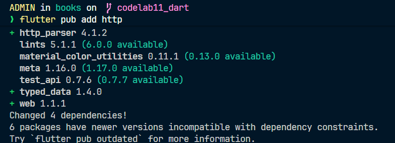
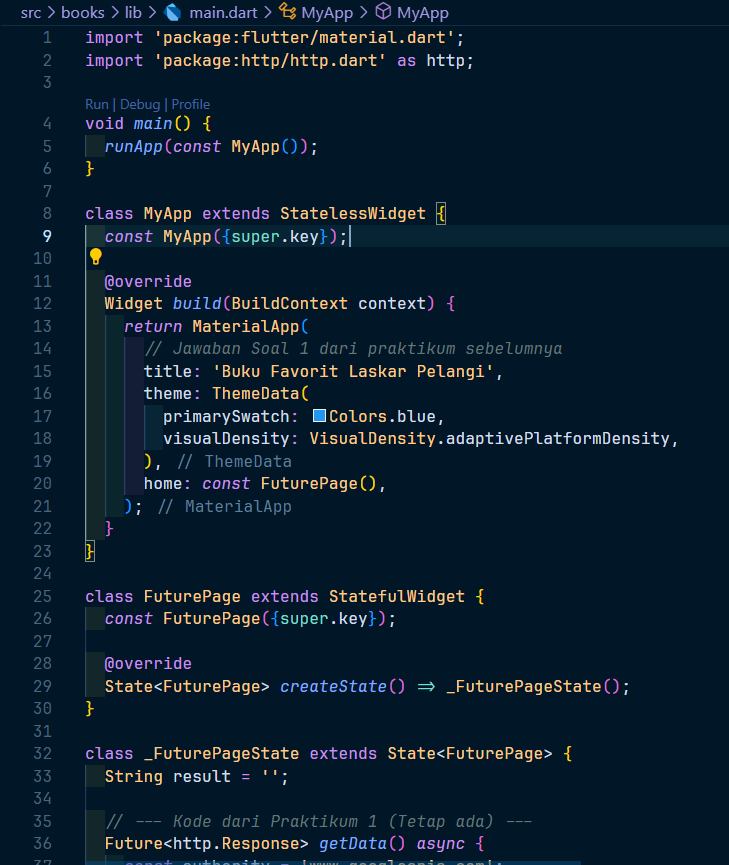
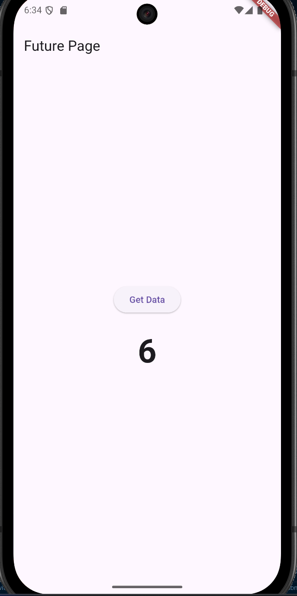
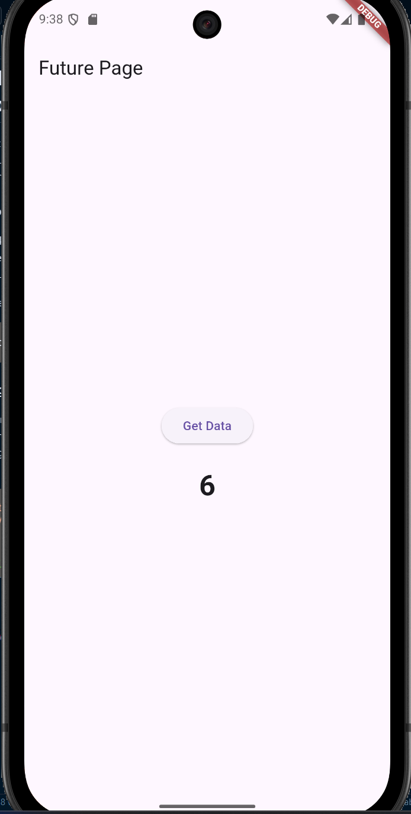

<p align="center">
  
</p>

<h1 align="center">LAPORAN PRAKTIKUM</h1>
<h2 align="center">JOBSHEET 11</h2>
<h3 align="center">Pemrograman Asynchronous</h3>

---

<div align="center">

### **Dosen Pembimbing**
**Habibie Ed Dien, S.Kom., M.T.**

---

### **Disusun oleh**
**Nama**  : Muhammad Rifda Musyaffa' 

**NIM**   : 2341720028 

**Kelas** : TI-3G  

**Program Studi** : D-4 Teknik Informatika  

---

### **Alamat Kampus**
Politeknik Negeri Malang  
Jl. Soekarno Hatta No.9, Jatimulyo, Kec. Lowokwaru, Kota Malang, Jawa Timur 65141
**Phone** : (0341) 404424, 404425
**Email** : [Polinema.ac.id](https://www.polinema.ac.id)

</div>

---

### Praktikum 1: Mengunduh Data dari Web Service (API)

## Langkah 1: Buat Project Baru
Buatlah sebuah project flutter baru dengan nama books di folder src week-11 repository GitHub Anda.


Kemudian Tambahkan dependensi http dengan mengetik perintah berikut di terminal.
```bash
flutter pub add http
```



## Langkah 2: Cek file pubspec.yaml
Jika berhasil install plugin, pastikan plugin http telah ada di file pubspec ini seperti berikut.

```yaml
dependencies:
  flutter:
    sdk: flutter
  http: ^1.1.0
```


**Kode:**


## Langkah 3, 4, 5: Kode main.dart (Termasuk Jawaban Soal 1)
Buka file lib/main.dart dan ganti seluruh isinya dengan kode lengkap di bawah ini. Kode ini sudah menggabungkan semua langkah (3, 4, dan 5) dan menyertakan jawaban untuk Soal 1 (Tambahkan nama panggilan Anda pada title app sebagai identitas hasil pekerjaan Anda).


```dart
import 'package:flutter/material.dart';
import 'package:http/http.dart' as http;
// Impor 'dart:convert' tidak diperlukan untuk langkah ini, 
// karena hanya menampilkan string mentah.

void main() {
  runApp(const MyApp());
}

class MyApp extends StatelessWidget {
  const MyApp({super.key});

  @override
  Widget build(BuildContext context) {
    return MaterialApp(
      // Jawaban untuk Soal 1:
      title: 'Buku Favorit Rifda',
      theme: ThemeData(
        primarySwatch: Colors.blue,
        visualDensity: VisualDensity.adaptivePlatformDensity,
      ),
      home: const FuturePage(),
    );
  }
}

class FuturePage extends StatefulWidget {
  const FuturePage({super.key});

  @override
  State<FuturePage> createState() => _FuturePageState();
}

class _FuturePageState extends State<FuturePage> {
  String result = ''; // Untuk menampung hasil dari API

  // Langkah 4: Method getData()
  Future<http.Response> getData() async {
    // Ganti ID buku 'zyTCAlFPjgYC' dengan ID buku favorit Anda
    // sesuai instruksi Soal 2.
    const authority = 'www.googleapis.com';
    const path = '/books/v1/volumes/zyTCAlFPjgYC'; 
    Uri url = Uri.https(authority, path);
    return http.get(url);
  }

  @override
  Widget build(BuildContext context) {
    // Ini adalah UI dari Langkah 3
    return Scaffold(
      appBar: AppBar(
        title: const Text('Future Page'),
      ),
      body: Center(
        child: Padding(
          padding: const EdgeInsets.all(16.0),
          child: Column(
            mainAxisAlignment: MainAxisAlignment.center,
            children: [
              // Langkah 5: ElevatedButton
              ElevatedButton(
                child: const Text('Get Data'),
                onPressed: () {
                  // Set state untuk menampilkan CircularProgressIndicator
                  setState(() {
                    result = '';
                  });

                  // Panggil getData()
                  getData().then((response) {
                    // Jika berhasil, tampilkan 450 karakter pertama dari body
                    setState(() {
                      result = response.body.substring(0, 450) + "...";
                    });
                  }).catchError((e) {
                    // Jika gagal, tampilkan pesan error
                    setState(() {
                      result = 'An error occurred';
                    });
                  });
                },
              ),
              const SizedBox(height: 20),
              
              // Catatan dari Langkah 3:
              // Menampilkan indikator loading jika result kosong,
              // atau menampilkan hasil jika sudah ada.
              result.isEmpty
                  ? const CircularProgressIndicator()
                  : Text(result),
            ],
          ),
        ),
      ),
    );
  }
}
```

**Kode**


### Carilah judul buku favorit Anda di Google Books, lalu ganti ID buku pada variabel path di kode tersebut. Kemudian cobalah akses di browser URI tersebut dengan lengkap seperti ini. Jika menampilkan data JSON, maka Anda telah berhasil. Lakukan capture milik Anda dan tulis di README pada laporan praktikum. Lalu lakukan commit dengan pesan "W11: Soal 2".

1. Mengakses link:
https://www.google.co.id/books/edition/Laskar_Pelangi/S0ZNe2iqM54C?hl=en&gbpv=1&dq=Laskar+Pelangi&pg=PA200&printsec=frontcover

2. Ambil kode unik: S0ZNe2iqM54C

3. Di dalam method getData() pada main.dart, ganti ID buku yang ada S0ZNe2iqM54C dengan ID buku yang baru.
```dart
Future<http.Response> getData() async {
    const authority = 'www.googleapis.com';
    const path = '/books/v1/volumes/S0ZNe2iqM54C';
    Uri url = Uri.https(authority, path);
    return http.get(url);
  }
```

**Kode**


**Hasil**


### Jelaskan maksud kode langkah 5 tersebut terkait substring dan catchError! Capture hasil praktikum Anda berupa GIF dan lampirkan di README. Lalu lakukan commit dengan pesan "W11: Soal 3".
penjelasan untuk kode pada onPressed di Langkah 5:
* substring(0, 450):

* response.body berisi seluruh data JSON dari API sebagai satu string (teks) yang sangat panjang.

* Method .substring(0, 450) berfungsi untuk memotong string tersebut.

* Ini mengambil karakter mulai dari indeks 0 (karakter pertama) hingga indeks 449 (tepat sebelum indeks 450).

* Tujuannya adalah agar teks yang ditampilkan di layar aplikasi tidak terlalu panjang dan hanya berupa cuplikan data saja, diikuti dengan "...".

* catchError((e) { ... }):

* getData() adalah sebuah Future (operasi asynchronous) yang mungkin gagal. Kegagalan bisa terjadi karena berbagai alasan, seperti tidak ada koneksi internet, server Google Books sedang bermasalah, atau ID buku tidak ditemukan.

* .catchError() adalah penangan kesalahan (error handler). Blok kode di dalamnya akan dieksekusi hanya jika Future (yaitu getData()) mengalami kegagalan.

* Di dalam blok ini, kita mengatur result menjadi 'An error occurred' untuk memberi tahu pengguna bahwa telah terjadi masalah, alih-alih membuat aplikasi crash atau tidak merespons.

**Hasil**


---

### Praktikum 2: Menggunakan await/async untuk menghindari callbacks
Ada alternatif penggunaan Future yang lebih clean, mudah dibaca dan dirawat, yaitu pola async/await. Intinya pada dua kata kunci ini:

async digunakan untuk menandai suatu method sebagai asynchronous dan itu harus ditambahkan di depan kode function.
await digunakan untuk memerintahkan menunggu sampai eksekusi suatu function itu selesai dan mengembalikan sebuah value. Untuk then bisa digunakan pada jenis method apapun, sedangkan await hanya bekerja di dalam method async.

Setelah Anda menyelesaikan praktikum 1, Anda dapat melanjutkan praktikum 2 ini. Selesaikan langkah-langkah praktikum berikut ini menggunakan editor Visual Studio Code (VS Code) atau Android Studio atau code editor lain kesukaan Anda. Jawablah di laporan praktikum Anda pada setiap soal yang ada di beberapa langkah praktikum ini.

Perhatian: Diasumsikan Anda telah berhasil menyelesaikan Praktikum 1.

Pada codelab ini, kita akan menambah kode dari aplikasi books di praktikum sebelumnya.

# Langkah 1: Buka file main.dart, Tambah method count(), Panggil count()
Lakukan comment kode sebelumnya, ubah isi
Tambahkan tiga method berisi kode seperti berikut di dalam class _FuturePageState. Lalu tambahkan lagi method ini di bawah ketiga method sebelumnya. Lakukan comment kode sebelumnya, ubah isi kode onPressed() menjadi seperti berikut.


```dart
import 'package:flutter/material.dart';
import 'package:http/http.dart' as http;

void main() {
  runApp(const MyApp());
}

class MyApp extends StatelessWidget {
  const MyApp({super.key});

  @override
  Widget build(BuildContext context) {
    return MaterialApp(
      // Jawaban Soal 1 dari praktikum sebelumnya
      title: 'Buku Favorit Laskar Pelangi', 
      theme: ThemeData(
        primarySwatch: Colors.blue,
        visualDensity: VisualDensity.adaptivePlatformDensity,
      ),
      home: const FuturePage(),
    );
  }
}

class FuturePage extends StatefulWidget {
  const FuturePage({super.key});

  @override
  State<FuturePage> createState() => _FuturePageState();
}

class _FuturePageState extends State<FuturePage> {
  String result = '';

  // --- Kode dari Praktikum 1 (Tetap ada) ---
  Future<http.Response> getData() async {
    const authority = 'www.googleapis.com';
    // ID Buku dari contoh kita sebelumnya
    const path = '/books/v1/volumes/S0ZNe2iqM54C'; 
    Uri url = Uri.https(authority, path);
    return http.get(url);
  }

  // --- Praktikum 2: Langkah 1 ---
  // Method ini menunggu 3 detik, lalu mengembalikan 1
  Future<int> returnOneAsync() async {
    await Future.delayed(const Duration(seconds: 3));
    return 1;
  }

  // Method ini menunggu 3 detik, lalu mengembalikan 2
  Future<int> returnTwoAsync() async {
    await Future.delayed(const Duration(seconds: 3));
    return 2;
  }

  // Method ini menunggu 3 detik, lalu mengembalikan 3
  Future<int> returnThreeAsync() async {
    await Future.delayed(const Duration(seconds: 3));
    return 3;
  }

  // --- Praktikum 2: Langkah 2 ---
  // Method ini memanggil ketiga method di atas secara BERURUTAN
  Future<int> count() async {
    int total = 0;
    
    // Menunggu 3 detik...
    total += await returnOneAsync(); 
    // Menunggu 3 detik lagi...
    total += await returnTwoAsync();
    // Menunggu 3 detik lagi...
    total += await returnThreeAsync();

    // Setelah 9 detik, perbarui UI dengan total
    setState(() {
      result = total.toString();
    });

    return total;
  }

  @override
  Widget build(BuildContext context) {
    return Scaffold(
      appBar: AppBar(
        title: const Text('Future Page'),
      ),
      body: Center(
        child: Padding(
          padding: const EdgeInsets.all(16.0),
          child: Column(
            mainAxisAlignment: MainAxisAlignment.center,
            children: [
              // --- Praktikum 2: Langkah 3 ---
              ElevatedButton(
                // Teks tombol masih 'Get Data' sesuai gambar di codelab
                child: const Text('Get Data'), 
                onPressed: () {
                  // Kode Praktikum 1 di-comment
                  /*
                  setState(() {
                    result = '';
                  });
                  getData().then((response) {
                    setState(() {
                      result = response.body.substring(0, 450) + "...";
                    });
                  }).catchError((e) {
                    setState(() {
                      result = 'An error occurred';
                    });
                  });
                  */
                  
                  // Tampilkan CircularProgressIndicator sebelum 'count' dimulai
                  setState(() {
                    result = '';
                  });
                  
                  count();
                },
              ),
              const SizedBox(height: 20),
              
              result.isEmpty
                  ? const CircularProgressIndicator()
                  : Text(
                      result,
                      style: const TextStyle(fontSize: 50, fontWeight: FontWeight.bold),
                    ),
            ],
          ),
        ),
      ),
    );
  }
}
```

**Kode**


**Hasil**


### Maksud Kode Langkah 1 (Tiga Method Awal)

  * `Future<int> returnOneAsync() async { ... }` (dan juga `Two`, `Three`)
  * **`async`**: Kata kunci `async` memberitahu Dart bahwa method ini adalah *asynchronous* (tidak langsung selesai). Ini secara otomatis membungkus nilai yang di-`return` (yaitu `1`) ke dalam sebuah `Future` (menjadi `Future<int>`).
  * **`await Future.delayed(...)`**: Ini adalah simulasi "tugas berat" yang butuh waktu, seperti mengunduh file atau query database. `await` memerintahkan eksekusi untuk **menjeda (pause) di dalam method ini** selama 3 detik. Yang penting, ini **tidak memblokir UI**, sehingga `CircularProgressIndicator` tetap bisa berputar.
  * **`return 1;`**: Setelah jeda 3 detik selesai, method ini mengembalikan nilai `1`.

### Maksud Kode Langkah 2 (Method `count()`)

  * `Future<int> count() async { ... }`
  * Method ini juga `async` karena ia menggunakan `await` di dalamnya.
  * **`total += await returnOneAsync();`**: Ini adalah bagian kuncinya.
    1.  `count()` memanggil `returnOneAsync()`.
    2.  `await` akan **menjeda eksekusi method `count()`** sampai `returnOneAsync()` selesai (yaitu setelah 3 detik).
    3.  Setelah 3 detik, `returnOneAsync()` memberikan nilai `1`, yang ditambahkan ke `total`.
  * **`total += await returnTwoAsync();`**: Eksekusi berlanjut.
    1.  `count()` memanggil `returnTwoAsync()`.
    2.  `await` kembali **menjeda `count()`** selama 3 detik lagi.
    3.  Setelah 3 detik, nilai `2` ditambahkan ke `total` (total sekarang 3).
  * **`total += await returnThreeAsync();`**: Proses yang sama terulang, menjeda 3 detik lagi, lalu menambahkan `3` (total sekarang 6).

**Kesimpulan Utama:**
Karena ketiga `await` dieksekusi secara **sekuensial (berurutan)**, total waktu yang dibutuhkan sebelum `setState` dipanggil adalah 3 + 3 + 3 = **9 detik**. Inilah mengapa hasil angka "6" baru muncul setelah 9 detik.

----

# Praktikum 3: Menggunakan Completer di Future
Menggunakan Future dengan then, catchError, async, dan await mungkin sudah cukup untuk banyak kasus, tetapi ada alternatif melakukan operasi async di Dart dan Flutter yaitu dengan class Completer.

Completer membuat object Future yang mana Anda dapat menyelesaikannya nanti (late) dengan return sebuah value atau error.

Setelah Anda menyelesaikan praktikum 2, Anda dapat melanjutkan praktikum 3 ini. Selesaikan langkah-langkah praktikum berikut ini menggunakan editor Visual Studio Code (VS Code) atau Android Studio atau code editor lain kesukaan Anda. Jawablah di laporan praktikum Anda pada setiap soal yang ada di beberapa langkah praktikum ini.

# Bagian 1: Implementasi Completer (Langkah 1-4)

lib/main.dart
```dart
import 'package:flutter/material.dart';
import 'package:http/http.dart' as http;
import 'dart:async'; // <-- Impor yang benar untuk Completer

void main() {
  runApp(const MyApp());
}

class MyApp extends StatelessWidget {
  const MyApp({super.key});

  @override
  Widget build(BuildContext context) {
    return MaterialApp(
      title: 'Buku Favorit Laskar Pelangi',
      theme: ThemeData(
        primarySwatch: Colors.blue,
        visualDensity: VisualDensity.adaptivePlatformDensity,
      ),
      home: const FuturePage(),
    );
  }
}

class FuturePage extends StatefulWidget {
  const FuturePage({super.key});

  @override
  State<FuturePage> createState() => _FuturePageState();
}

class _FuturePageState extends State<FuturePage> {
  String result = '';

  // --- Kode dari Praktikum 1 ---
  Future<http.Response> getData() async {
    const authority = 'www.googleapis.com';
    const path = '/books/v1/volumes/S0ZNe2iqM54C';
    Uri url = Uri.https(authority, path);
    return http.get(url);
  }

  // --- Kode dari Praktikum 2 ---
  Future<int> returnOneAsync() async {
    await Future.delayed(const Duration(seconds: 3));
    return 1;
  }

  Future<int> returnTwoAsync() async {
    await Future.delayed(const Duration(seconds: 3));
    return 2;
  }

  Future<int> returnThreeAsync() async {
    await Future.delayed(const Duration(seconds: 3));
    return 3;
  }

  Future<int> count() async {
    int total = 0;
    total += await returnOneAsync();
    total += await returnTwoAsync();
    total += await returnThreeAsync();
    setState(() {
      result = total.toString();
    });
    return total;
  }

  // --- Praktikum 3: Langkah 2 ---
  late Completer completer;

  Future getNumber() {
    completer = Completer<int>();
    calculate(); // Memulai 'pekerjaan'
    return completer.future; // Mengembalikan 'tiket' Future
  }

  Future calculate() async {
    // Simulasi pekerjaan berat selama 5 detik
    await Future.delayed(const Duration(seconds: 5));
    // Selesaikan Future dengan nilai 42
    completer.complete(42);
  }
  // --- Akhir Langkah 2 ---

  @override
  Widget build(BuildContext context) {
    return Scaffold(
      appBar: AppBar(
        title: const Text('Future Page'),
      ),
      body: Center(
        child: Padding(
          padding: const EdgeInsets.all(16.0),
          child: Column(
            mainAxisAlignment: MainAxisAlignment.center,
            children: [
              ElevatedButton(
                child: const Text('Get Data'),
                onPressed: () {
                  // --- Praktikum 3: Langkah 3 ---

                  // Kode Praktikum 2 di-comment
                  // setState(() { result = ''; });
                  // count();

                  // Reset UI untuk menampilkan loading
                  setState(() {
                    result = '';
                  });
                  
                  // Panggil getNumber() dan tunggu hasilnya
                  getNumber().then((value) {
                    setState(() {
                      result = value.toString();
                    });
                  });
                  // --- Akhir Langkah 3 ---
                },
              ),
              const SizedBox(height: 20),
              
              result.isEmpty
                  ? const CircularProgressIndicator()
                  : Text(
                      result,
                      style: const TextStyle(fontSize: 32, fontWeight: FontWeight.bold),
                    ),
            ],
          ),
        ),
      ),
    );
  }
}
```

**Kode**


**Hasil**


### 💡 Jawaban Soal 5

> Jelaskan maksud kode langkah 2 tersebut\!

Kode pada Langkah 2 mendemonstrasikan cara kerja `Completer` untuk memisahkan antara "peminta" (yang memanggil `getNumber`) dan "pekerja" (yang melakukan `calculate`).

  * `late Completer completer;`: Mendeklarasikan sebuah variabel `Completer` yang akan diinisialisasi nanti. `Completer` adalah objek khusus yang bisa membuat `Future` dan menyelesaikannya (memberi nilai atau error) secara manual kapan pun kita mau.

  * `Future getNumber()`:

    1.  `completer = Completer<int>();`: Membuat objek `Completer` baru.
    2.  `calculate();`: Memanggil fungsi `calculate` untuk mulai bekerja di latar belakang. Penting: kita **tidak** `await` di sini.
    3.  `return completer.future;`: Ini adalah kuncinya. Method ini **langsung mengembalikan** sebuah `Future` (seperti "tiket janji") kepada siapa pun yang memanggilnya (yaitu, `onPressed`). `onPressed` akan menunggu "tiket" ini selesai.

  * `Future calculate() async`:

    1.  `await Future.delayed(...)`: Mensimulasikan pekerjaan berat (misal: download) yang butuh waktu 5 detik.
    2.  `completer.complete(42);`: Setelah 5 detik, "pekerja" ini **secara manual menyelesaikan** `Future` yang tadi dipegang oleh `onPressed` dengan memberikan nilai `42`.

Singkatnya: `getNumber()` memberikan `onPressed` sebuah `Future` (janji) dan menyuruh `calculate()` mulai bekerja. Lima detik kemudian, `calculate()` memenuhi janji itu dengan nilai `42`, yang kemudian memicu blok `.then()` di `onPressed`.

-----

### Bagian 2: Menangani Error (Langkah 5-6)

#### Kode `main.dart` 

Mengubah method `calculate()` dan `onPressed()` dari kode sebelumnya.

```dart
import 'package:flutter/material.dart';
import 'package:http/http.dart' as http;
import 'dart:async'; // <-- Impor yang benar untuk Completer

void main() {
  runApp(const MyApp());
}

class MyApp extends StatelessWidget {
  const MyApp({super.key});

  @override
  Widget build(BuildContext context) {
    return MaterialApp(
      title: 'Buku Favorit Laskar Pelangi',
      theme: ThemeData(
        primarySwatch: Colors.blue,
        visualDensity: VisualDensity.adaptivePlatformDensity,
      ),
      home: const FuturePage(),
    );
  }
}

class FuturePage extends StatefulWidget {
  const FuturePage({super.key});

  @override
  State<FuturePage> createState() => _FuturePageState();
}

class _FuturePageState extends State<FuturePage> {
  String result = '';

  // --- Kode dari Praktikum 1 ---
  Future<http.Response> getData() async {
    const authority = 'www.googleapis.com';
    const path = '/books/v1/volumes/S0ZNe2iqM54C';
    Uri url = Uri.https(authority, path);
    return http.get(url);
  }

  // --- Kode dari Praktikum 2 ---
  Future<int> returnOneAsync() async {
    await Future.delayed(const Duration(seconds: 3));
    return 1;
  }

  Future<int> returnTwoAsync() async {
    await Future.delayed(const Duration(seconds: 3));
    return 2;
  }

  Future<int> returnThreeAsync() async {
    await Future.delayed(const Duration(seconds: 3));
    return 3;
  }

  Future<int> count() async {
    int total = 0;
    total += await returnOneAsync();
    total += await returnTwoAsync();
    total += await returnThreeAsync();
    setState(() {
      result = total.toString();
    });
    return total;
  }

  // --- Praktikum 3: Langkah 2 ---
  late Completer completer;

  Future getNumber() {
    completer = Completer<int>();
    calculate(); // Memulai 'pekerjaan'
    return completer.future; // Mengembalikan 'tiket' Future
  }

  Future calculate() async {
    // Versi lama (Langkah 2) di-comment
    // await Future.delayed(const Duration(seconds: 5));
    // completer.complete(42);

    // Versi baru (Langkah 5) - sengaja membuat error
    await Future.delayed(const Duration(seconds: 5));
    completer.completeError('An error occurred'); // Kirim sinyal error
  }
  // --- Akhir Langkah 2 ---

  @override
  Widget build(BuildContext context) {
    return Scaffold(
      appBar: AppBar(
        title: const Text('Future Page'),
      ),
      body: Center(
        child: Padding(
          padding: const EdgeInsets.all(16.0),
          child: Column(
            mainAxisAlignment: MainAxisAlignment.center,
            children: [
              ElevatedButton(
                child: const Text('Get Data'),
                onPressed: () {
                  // Kode Langkah 3 di-comment
                  /*
                  setState(() { result = ''; });
                  getNumber().then((value) {
                    setState(() {
                      result = value.toString();
                    });
                  });
                  */

                  // Reset UI untuk menampilkan loading
                  setState(() {
                    result = '';
                  });

                  // Panggil getNumber() dan tunggu hasilnya ATAU error
                  getNumber().then((value) {
                    // Ini tidak akan terpanggil jika ada error
                    setState(() {
                      result = value.toString();
                    });
                  }).catchError((e) {
                    // Ini akan menangkap error dari completer.completeError
                    setState(() {
                      result = e.toString(); // Tampilkan pesan error
                    });
                  });
                },
              ),
              const SizedBox(height: 20),
              
              result.isEmpty
                  ? const CircularProgressIndicator()
                  : Text(
                      result,
                      style: const TextStyle(fontSize: 32, fontWeight: FontWeight.bold),
                    ),
            ],
          ),
        ),
      ),
    );
  }
}
```
**Kode**


**Hasil**


### 💡 Jawaban Soal 6

> Jelaskan maksud perbedaan kode langkah 2 dengan langkah 5-6 tersebut\!

Perbedaan utamanya adalah **penanganan skenario sukses vs. skenario kegagalan**.

  * **Langkah 2 (Skenario Sukses):**

      * `calculate()`: Didesain untuk selalu **berhasil**. Ia memanggil `completer.complete(42)` untuk menyelesaikan `Future` dengan sebuah nilai.
      * `onPressed()` (Langkah 3): Hanya menggunakan `.then()`. Kode ini "optimis" dan hanya menangani kasus sukses. Jika `calculate` gagal, aplikasi bisa *crash* karena tidak ada yang menangkap error.

  * **Langkah 5-6 (Skenario Gagal):**

      * `calculate()` (Langkah 5): Didesain untuk selalu **gagal**. Ia sengaja memanggil `completer.completeError('An error occurred')` untuk menyelesaikan `Future` dengan sebuah error.
      * `onPressed()` (Langkah 6): Kode ini **robust** (tangguh).
          * `.then((value) ...)`: Blok ini hanya akan berjalan jika `Future` selesai dengan **sukses** (misalnya jika kita masih pakai `calculate` dari Langkah 2).
          * `.catchError((e) ...)`: Blok ini ditambahkan untuk menangkap sinyal error yang dikirim oleh `completer.completeError()`. Ini mencegah aplikasi crash dan mengizinkan kita menampilkan pesan error yang ramah kepada pengguna.

Singkatnya, Langkah 2-3 menunjukkan cara kerja `Completer` saat semua berjalan lancar. Langkah 5-6 menunjukkan cara `Completer` memberitahu adanya kegagalan (`completeError`) dan cara UI menangkap kegagalan tersebut (`catchError`).

-----

# Praktikum 4: Memanggil Future secara paralel

Praktikum ini adalah poin penting karena menunjukkan perbedaan besar antara eksekusi **sekuensial** (Praktikum 2, total 9 detik) dan **paralel** (Praktikum 4, total 3 detik).

### Langkah 0: Tambah Dependensi `async`

Praktikum ini memerlukan package `async` yang **berbeda** dari `dart:async`. Anda harus menambahkannya ke `pubspec.yaml` terlebih dahulu.

Jalankan perintah ini di terminal Anda:

```bash
flutter pub add async
```

### Kode `main.dart` (Langkah 1-3)
Kode `main.dart` lengkap yang telah diperbarui. Menambahkan impor baru dan method `parallelFetch()` dari **Langkah 1**, dan memanggilnya di `onPressed()` sesuai **Langkah 2**.

```dart
import 'package:flutter/material.dart';
import 'package:http/http.dart' as http;
import 'dart:async'; 

// --- Praktikum 4: Langkah 1 (Impor Baru) ---
import 'package:async/async.dart'; 

void main() {
  runApp(const MyApp());
}

class MyApp extends StatelessWidget {
  const MyApp({super.key});

  @override
  Widget build(BuildContext context) {
    return MaterialApp(
      title: 'Buku Favorit Laskar Pelangi',
      theme: ThemeData(
        primarySwatch: Colors.blue,
        visualDensity: VisualDensity.adaptivePlatformDensity,
      ),
      home: const FuturePage(),
    );
  }
}

class FuturePage extends StatefulWidget {
  const FuturePage({super.key});

  @override
  State<FuturePage> createState() => _FuturePageState();
}

class _FuturePageState extends State<FuturePage> {
  String result = '';

  // --- Kode dari Praktikum 1 ---
  Future<http.Response> getData() async {
    const authority = 'www.googleapis.com';
    const path = '/books/v1/volumes/S0ZNe2iqM54C';
    Uri url = Uri.https(authority, path);
    return http.get(url);
  }

  // --- Kode dari Praktikum 2 ---
  Future<int> returnOneAsync() async {
    await Future.delayed(const Duration(seconds: 3));
    return 1;
  }

  Future<int> returnTwoAsync() async {
    await Future.delayed(const Duration(seconds: 3));
    return 2;
  }

  Future<int> returnThreeAsync() async {
    await Future.delayed(const Duration(seconds: 3));
    return 3;
  }

  // --- Kode dari Praktikum 3 ---
  late Completer completer;
  Future getNumber() {
    completer = Completer<int>();
    calculate();
    return completer.future;
  }
  Future calculate() async {
    await Future.delayed(const Duration(seconds: 5));
    completer.completeError('An error occurred');
  }
  
  // --- Praktikum 4: Langkah 1 (Method Baru) ---
  Future parallelFetch() async {
    // 1. Buat grup
    FutureGroup<int> futureGroup = FutureGroup<int>();

    // 2. Tambahkan semua future ke grup. 
    //    Ini akan mulai menjalankannya secara bersamaan.
    futureGroup.add(returnOneAsync());
    futureGroup.add(returnTwoAsync());
    futureGroup.add(returnThreeAsync());

    // 3. 'Tutup' grup, menandakan tidak ada lagi future yang akan ditambah
    futureGroup.close();

    // 4. Tunggu semua future dalam grup selesai
    //    'future' di sini adalah properti dari FutureGroup
    final futures = await futureGroup.future; 

    // 5. Hitung total dari List<int> yang dikembalikan
    int total = 0;
    for (var num in futures) {
      total += num;
    }
    
    // 6. Perbarui UI
    setState(() {
      result = total.toString();
    });
  }
  // --- Akhir Langkah 1 ---

  @override
  Widget build(BuildContext context) {
    return Scaffold(
      appBar: AppBar(
        title: const Text('Future Page'),
      ),
      body: Center(
        child: Padding(
          padding: const EdgeInsets.all(16.0),
          child: Column(
            mainAxisAlignment: MainAxisAlignment.center,
            children: [
              ElevatedButton(
                child: const Text('Get Data'),
                onPressed: () {
                  // --- Praktikum 4: Langkah 2 ---
                  
                  // Kode Praktikum 3 di-comment
                  /*
                  setState(() { result = ''; });
                  getNumber().then((value) {
                    setState(() {
                      result = value.toString();
                    });
                  }).catchError((e) {
                    setState(() {
                      result = e.toString();
                    });
                  });
                  */

                  // Reset UI untuk loading
                  setState(() {
                    result = '';
                  });

                  // Panggil method paralel
                  parallelFetch();

                  // --- Akhir Langkah 2 ---
                },
              ),
              const SizedBox(height: 20),
              
              result.isEmpty
                  ? const CircularProgressIndicator()
                  : Text(
                      result,
                      style: const TextStyle(fontSize: 32, fontWeight: FontWeight.bold),
                    ),
            ],
          ),
        ),
      ),
    );
  }
}
```

**Kode**


**Hasil**


### Hasil (Langkah 3 & Soal 7)

Saat menjalankan kode ini dan menekan tombol 'Get Data':

1.  `CircularProgressIndicator` akan muncul.
2.  Ketiga method (`returnOneAsync`, `returnTwoAsync`, `returnThreeAsync`) akan berjalan **pada saat yang bersamaan**.
3.  Karena ketiganya butuh 3 detik, maka total waktu tunggunya **hanya 3 detik** (bukan 9 detik seperti di Praktikum 2).
4.  Setelah 3 detik, angka **6** akan muncul di layar.

Ini adalah tujuan dari Soal 7, untuk menunjukkan hasil eksekusi paralel yang jauh lebih cepat.

-----

### 💡 Jawaban Soal 8

> Jelaskan maksud perbedaan kode langkah 1 dan 4\!

Perbedaan utamanya adalah **sumber library** dan **fleksibilitas**. Keduanya sama-sama bertujuan menjalankan `Future` secara paralel.

**Langkah 1: `FutureGroup`**

  * **Library:** Berasal dari package eksternal `package:async/async.dart` (yang baru saja kita tambahkan).
  * **Cara Pakai:** Ini adalah sebuah *objek*. Anda membuat *instance* dari `FutureGroup`, lalu Anda bisa **menambahkan** `Future` satu per satu menggunakan method `.add()`. Setelah selesai, Anda panggil `.close()`.
  * **Fleksibilitas:** Ini lebih fleksibel. Anda bisa menambah `Future` ke grup secara dinamis, misalnya di dalam *loop* atau berdasarkan kondisi `if`.

**Langkah 4: `Future.wait`**

  * **Library:** Berasal dari library **bawaan** Dart, `dart:async`.
  * **Cara Pakai:** Ini adalah *static method*. Anda memanggilnya satu kali dan harus langsung memberikan **seluruh `List`** dari `Future` yang ingin Anda jalankan.
  * **Fleksibilitas:** Kurang fleksibel karena Anda harus sudah tahu semua `Future`-nya di awal. Namun, ini lebih **sederhana** dan **ringkas** jika Anda hanya punya daftar `Future` yang sudah pasti.

**Kesimpulan:**
Keduanya mencapai hasil yang sama (eksekusi paralel).

  * Gunakan `Future.wait` (Langkah 4) jika Anda memiliki daftar `Future` yang tetap dan ingin kode yang simpel (ini adalah cara yang paling umum).
  * Gunakan `FutureGroup` (Langkah 1) jika Anda perlu menambahkan `Future` ke dalam "kumpulan" secara dinamis atau kondisional.

----

# Praktikum 5: Menangani Respon Error pada Async Code

### Bagian 1: Penanganan Error dengan `.catchError()` (Langkah 1-3)

Pertama, tambahkan method dari **Langkah 1** dan memperbarui `ElevatedButton` sesuai **Langkah 2**. Ini menunjukkan cara menangani error menggunakan *callback* `.catchError()`.

#### Kode `main.dart` (Langkah 1-3)

```dart
import 'package:flutter/material.dart';
import 'package:http/http.dart' as http;
import 'dart:async';
import 'package:async/async.dart';

void main() {
  runApp(const MyApp());
}

class MyApp extends StatelessWidget {
  const MyApp({super.key});

  @override
  Widget build(BuildContext context) {
    return MaterialApp(
      title: 'Buku Favorit Laskar Pelangi',
      theme: ThemeData(
        primarySwatch: Colors.blue,
        visualDensity: VisualDensity.adaptivePlatformDensity,
      ),
      home: const FuturePage(),
    );
  }
}

class FuturePage extends StatefulWidget {
  const FuturePage({super.key});

  @override
  State<FuturePage> createState() => _FuturePageState();
}

class _FuturePageState extends State<FuturePage> {
  String result = '';

  // --- Kode dari Praktikum 1 s/d 4 ---
  // (Method getData, returnOne, Two, Three, getNumber, calculate, parallelFetch
  // sebaiknya tetap ada di sini untuk kelengkapan, 
  // tapi saya sembunyikan agar fokus ke Praktikum 5)

  // --- Praktikum 5: Langkah 1 ---
  Future<int> returnError() async {
    await Future.delayed(const Duration(seconds: 2));
    // 1. Melemparkan (throw) error secara sengaja
    throw Exception('Something bad happened'); 
  }

  void returnErrorWithThen() {
    // 2. Memanggil method yang akan gagal
    returnError().then((value) {
      // 3. Blok .then() ini akan DILEWATI
      setState(() {
        result = 'Success'; // Ini tidak akan pernah dijalankan
      });
    }).catchError((e) {
      // 4. Eksekusi akan langsung lompat ke .catchError()
      setState(() {
        result = e.toString(); // Menampilkan pesan error di UI
      });
    }).whenComplete(() {
      // 5. .whenComplete() selalu dijalankan, baik sukses maupun gagal
      // Ini sesuai dengan gambar 'Complete' di debug console
      debugPrint('Complete'); 
    });
  }
  // --- Akhir Langkah 1 ---

  @override
  Widget build(BuildContext context) {
    return Scaffold(
      appBar: AppBar(
        title: const Text('Future Page'),
      ),
      body: Center(
        child: Padding(
          padding: const EdgeInsets.all(16.0),
          child: Column(
            mainAxisAlignment: MainAxisAlignment.center,
            children: [
              // --- Praktikum 5: Langkah 2 ---
              // Ganti nama tombol menjadi 'GO!'
              ElevatedButton(
                child: const Text('GO!'), 
                onPressed: () {
                  // Kode Praktikum 4 di-comment
                  // setState(() { result = ''; });
                  // parallelFetch();
                  
                  // Reset UI untuk loading
                  setState(() {
                    result = '';
                  });
                  
                  // Panggil method dari Langkah 1
                  returnErrorWithThen();
                },
              ),
              // --- Akhir Langkah 2 ---

              const SizedBox(height: 20),
              
              result.isEmpty
                  ? const CircularProgressIndicator()
                  : Text(
                      result,
                      // Beri warna merah jika error
                      style: const TextStyle(fontSize: 18, color: Colors.red),
                    ),
            ],
          ),
        ),
      ),
    );
  }
}
```

**Kode**


**Hasil**


#### Hasil (Langkah 3 & Soal 9)

Saat Anda menjalankan kode ini dan menekan tombol 'GO\!':

1.  `CircularProgressIndicator` akan muncul.
2.  Setelah 2 detik, `returnError()` akan melemparkan `Exception`.
3.  Blok `.then()` akan dilewati, dan blok `.catchError()` akan dieksekusi.
4.  UI akan menampilkan pesan error: `Exception: Something bad happened`.
5.  Di **Debug Console** Anda, Anda akan melihat teks `Complete` dicetak. Ini membuktikan bahwa `.whenComplete()` selalu berjalan.

### Bagian 2: Penanganan Error dengan `try-catch` (Langkah 4 & Soal 10)

Sekarang, tambahkan method `handleError()` dari **Langkah 4** dan panggil di `ElevatedButton` untuk menjawab **Soal 10**.

#### Modifikasi `main.dart` (Langkah 4 & Soal 10)

```dart
// ... (Salin semua kode dari Bagian 1, lalu tambahkan method baru 
//      dan ubah 'onPressed' di bawah) ...

class _FuturePageState extends State<FuturePage> {
  // ... (semua variabel dan method lain tetap sama) ...

  // --- Praktikum 5: Langkah 1 (Sudah ada) ---
  Future<int> returnError() async {
    await Future.delayed(const Duration(seconds: 2));
    throw Exception('Something bad happened');
  }

  void returnErrorWithThen() {
    // ... (method ini tetap ada, tidak diubah) ...
  }
  
  // --- Praktikum 5: Langkah 4 (Method Baru) ---
  void handleError() async {
    // 1. Menggunakan blok 'try-catch', mirip di bahasa pemrograman lain
    try {
      // 2. Kita 'await' (menunggu) method yang mungkin gagal
      await returnError();
      
      // 3. Baris ini akan DILEWATI jika returnError() gagal
      setState(() {
        result = 'Success'; // Ini tidak akan pernah dijalankan
      });
    } catch (e) {
      // 4. Jika 'try' gagal, eksekusi lompat ke blok 'catch'
      setState(() {
        result = e.toString(); // Menampilkan pesan error di UI
      });
    } finally {
      // 5. 'finally' sama seperti .whenComplete(), selalu dijalankan
      debugPrint('Complete');
    }
  }
  // --- Akhir Langkah 4 ---

  @override
  Widget build(BuildContext context) {
    return Scaffold(
      appBar: AppBar(
        // ... (sama seperti sebelumnya)
      ),
      body: Center(
        child: Padding(
          padding: const EdgeInsets.all(16.0),
          child: Column(
            mainAxisAlignment: MainAxisAlignment.center,
            children: [
              ElevatedButton(
                child: const Text('GO!'),
                onPressed: () {
                  // --- Praktikum 5: Jawaban Soal 10 ---
                  
                  // Kode Langkah 2 di-comment
                  // setState(() { result = ''; });
                  // returnErrorWithThen();
                  
                  // Reset UI untuk loading
                  setState(() {
                    result = '';
                  });
                  
                  // Panggil method dari Langkah 4
                  handleError();
                  // --- Akhir Jawaban Soal 10 ---
                },
              ),
              const SizedBox(height: 20),
              
              result.isEmpty
                  ? const CircularProgressIndicator()
                  : Text(
                      result,
                      style: const TextStyle(fontSize: 18, color: Colors.red),
                    ),
            ],
          ),
        ),
      ),
    );
  }
}
```
**Kode**


**Hasil**


### 💡 Jawaban Soal 10

> Panggil method `handleError()` tersebut di `ElevatedButton`, lalu run. Apa hasilnya? Jelaskan perbedaan kode langkah 1 dan 4\!

#### Hasil

Saat `handleError()` dipanggil (setelah mengganti kode di `onPressed`), hasilnya akan **PERSIS SAMA** dengan Langkah 3:

1.  `CircularProgressIndicator` muncul.
2.  Setelah 2 detik, UI menampilkan pesan error: `Exception: Something bad happened`.
3.  Di **Debug Console**, teks `Complete` akan dicetak.

#### Penjelasan Perbedaan (Langkah 1 vs. Langkah 4)

Perbedaannya terletak pada **gaya penulisan** dan **konteks penggunaan**:

1.  **Langkah 1 (`.catchError`)**:

      * **Gaya:** *Callback-style* (Gaya Panggilan Balik) atau *Functional-style*. Anda merangkai (`chaining`) method `.then().catchError().whenComplete()`.
      * **Konteks:** Ini adalah cara klasik menangani `Future` di Dart. Ini sangat berguna jika Anda **tidak** berada di dalam method `async`.

2.  **Langkah 4 (`try-catch`)**:

      * **Gaya:** *Imperative-style* (Gaya Perintah) atau *Synchronous-looking-style*. Kode ini terlihat seperti kode sinkronus (non-asynchronous) biasa.
      * **Konteks:** Cara ini **hanya bisa** digunakan di dalam method yang ditandai `async` (perhatikan: `void handleError() async { ... }`). Ini sering dianggap lebih bersih dan mudah dibaca oleh banyak *developer* karena alur programnya (termasuk penanganan error) terlihat lurus dari atas ke bawah. `try` menggantikan `.then()`, `catch` menggantikan `.catchError()`, dan `finally` menggantikan `.whenComplete()`.

**Kesimpulan:** Keduanya adalah cara yang valid untuk menangani error pada `Future`. `try-catch` (Langkah 4) adalah pendekatan modern yang sering disukai di dalam method `async`, sedangkan `.catchError()` (Langkah 1) adalah pendekatan klasik yang masih sangat relevan.

----

# Praktikum 6: Menggunakan Future dengan StatefulWidget

Praktikum ini sedikit berbeda karena kita akan membuat file baru dan mengkonfigurasi izin (permission) di level platform (Android/iOS). Ini adalah langkah penting dalam pengembangan aplikasi Flutter yang sesungguhnya.

### Langkah 1: Install Plugin

Di terminal proyek, ayo jalankan:

```bash
flutter pub add geolocator
```

### Langkah 2: Tambah Permission GPS (Android)

Ini adalah langkah yang **sangat penting**. Jika salah, plugin tidak akan berfungsi.

1.  Buka file: `android/app/src/main/AndroidManifest.xml`

2.  Tambahkan dua baris berikut **di dalam** tag `<manifest ...>` tetapi **di luar** tag `<application ...>`.

    ```xml
    <?xml version="1.0" encoding="utf-8"?>
    <manifest xmlns:android="http://schemas.android.com/apk/res/android"
        package="com.example.books">

        <uses-permission android:name="android.permission.ACCESS_FINE_LOCATION" />
        <uses-permission android:name="android.permission.ACCESS_COARSE_LOCATION" />

        <application
            android:label="books"
            android:name="${applicationName}"
            android:icon="@mipmap/ic_launcher">
            <activity
                ...
    ```
**Kode**


3.  Setelah menambahkan ini, **hentikan aplikasi Anda sepenuhnya** dan jalankan ulang (`flutter run`). *Hot restart* saja tidak cukup untuk menerapkan perubahan file native ini.

### Langkah 3, 4, 5, 8 & Soal 11, 12: File `geolocation.dart`

Buat file baru di dalam folder `lib/` bernama `geolocation.dart`.

Salin dan tempelkan **seluruh kode** di bawah ini ke dalam file `geolocation.dart`. Kode ini sudah mencakup:

  * Langkah 3, 4, 5: Struktur dasar `StatefulWidget`.
  * Langkah 8: Logika animasi loading (`_isLoading`).
  * **Jawaban Soal 11:** Penambahan nama di `title`.
  * **Jawaban Soal 12 (Delay):** Penambahan `Future.delayed` di `getPosition()`.

```dart
import 'package:flutter/material.dart';
import 'package:geolocator/geolocator.dart';

class LocationScreen extends StatefulWidget {
  const LocationScreen({super.key});

  @override
  State<LocationScreen> createState() => _LocationScreenState();
}

class _LocationScreenState extends State<LocationScreen> {
  String? position;
  bool _isLoading = false; // Langkah 8: Variabel untuk state loading

  @override
  void initState() {
    super.initState();
    // Panggil method untuk mengambil lokasi saat widget pertama kali dibuat
    getPosition();
  }

  // Method untuk mengambil lokasi GPS
  Future<void> getPosition() async {
    // Langkah 8: Set loading jadi true
    setState(() {
      _isLoading = true;
    });

    // Cek izin (permission)
    LocationPermission permission = await Geolocator.checkPermission();
    if (permission == LocationPermission.denied) {
      permission = await Geolocator.requestPermission();
      if (permission == LocationPermission.denied) {
        // Izin ditolak, tampilkan pesan
        setState(() {
          position = 'Location permissions are denied';
          _isLoading = false; // Langkah 8: Set loading jadi false
        });
        return;
      }
    }

    if (permission == LocationPermission.deniedForever) {
      // Izin ditolak permanen
      setState(() {
        position = 'Location permissions are permanently denied';
        _isLoading = false; // Langkah 8: Set loading jadi false
      });
      return;
    }

    // Jawaban Soal 12: Tambahkan delay 3 detik untuk simulasi
    await Future.delayed(const Duration(seconds: 3));

    // Ambil lokasi
    try {
      final currentPosition = await Geolocator.getCurrentPosition(
        desiredAccuracy: LocationAccuracy.high,
      );
      // Update state dengan data lokasi
      setState(() {
        position =
            'Latitude: ${currentPosition.latitude}, Longitude: ${currentPosition.longitude}';
        _isLoading = false; // Langkah 8: Set loading jadi false
      });
    } catch (e) {
      // Tangani jika ada error
      setState(() {
        position = 'Error retrieving location: $e';
        _isLoading = false; // Langkah 8: Set loading jadi false
      });
    }
  }

  @override
  Widget build(BuildContext context) {
    return Scaffold(
      appBar: AppBar(
        // Jawaban Soal 11: Ganti [Nama Panggilan Anda]
        title: const Text('GPS Location - [Nama Panggilan Anda]'),
      ),
      body: Center(
        // Langkah 8: Tampilkan loading atau hasil
        child: _isLoading
            ? const CircularProgressIndicator() // Tampilkan loading
            : Text(
                position ?? 'Fetching location...', // Tampilkan hasil
                textAlign: TextAlign.center,
                style: const TextStyle(fontSize: 18, fontWeight: FontWeight.bold),
              ),
      ),
    );
  }
}
```

**Kode**


### Langkah 6: Edit `main.dart`

Sekarang, ubah file `lib/main.dart` Anda agar memanggil `LocationScreen` sebagai halaman utama.

Bisa menghapus/mengomentari kode dari praktikum sebelumnya. File `main.dart` bisa menjadi sesederhana ini:

```dart
import 'package:flutter/material.dart';
// 1. Impor file baru
import 'package:books/geolocation.dart'; 

void main() {
  runApp(const MyApp());
}

class MyApp extends StatelessWidget {
  const MyApp({super.key});

  @override
  Widget build(BuildContext context) {
    return MaterialApp(
      // Jawaban Soal 11 (Juga ada di main.dart)
      title: 'Praktikum GPS [Rifda]',
      theme: ThemeData(
        primarySwatch: Colors.blue,
        visualDensity: VisualDensity.adaptivePlatformDensity,
      ),
      // 2. Ganti 'home' untuk memanggil LocationScreen
      home: const LocationScreen(), 
    );
  }
}
```

**Kode**


### Langkah 7: Run

Jalankan aplikasi ini pada **Emulator Android** atau **Device Fisik**. Pastikan Anda menghentikan aplikasi sepenuhnya dan menjalankannya lagi (bukan *hot restart*) agar izin di AndroidManifest.xml terbaca.

Saat aplikasi meminta izin lokasi, **pastikan Anda menyetujuinya**.

### 💡 Jawaban Soal 12 (Penjelasan)

> Apakah Anda mendapatkan koordinat GPS ketika run di browser? Mengapa demikian?

**Jawaban:** **Tidak**, Anda tidak akan mendapatkan koordinat GPS jika menjalankan aplikasi ini di *browser desktop* (seperti Chrome di Windows/macOS).

**Alasan (Mengapa):**

Plugin `geolocator` bekerja dengan cara memanggil API **native** (bawaan) dari sistem operasi.

1.  Di **Android**, ia memanggil layanan GPS dan lokasi dari OS Android.
2.  Di **iOS**, ia memanggil layanan "Core Location" dari OS iOS.

*Flutter for Web* (yang berjalan di browser) dieksekusi dalam lingkungan *sandbox* (terisolasi) browser. Browser desktop **tidak memiliki akses langsung** ke perangkat keras GPS di komputer Anda seperti halnya ponsel.

Meskipun browser modern memiliki API Geolokasi sendiri (biasanya berbasis Wi-Fi atau alamat IP), plugin `geolocator` tidak secara otomatis menggunakan itu untuk *build* web di *desktop*. Oleh karena itu, codelab ini secara spesifik menginstruksikan untuk menjalankannya di *device* atau *emulator*, di mana akses ke GPS (atau GPS yang disimulasikan) tersedia.

**Hasil**


----

# Praktikum 7: Manajemen Future dengan FutureBuilder
Pola ketika menerima beberapa data secara async dan melakukan update pada UI sebenarnya itu tergantung pada ketersediaan data. Secara umum fakta di Flutter, ada sebuah widget yang membantu Anda untuk memudahkan manajemen future yaitu widget FutureBuilder.

Anda dapat menggunakan FutureBuilder untuk manajemen future bersamaan dengan update UI ketika ada update Future. FutureBuilder memiliki status future sendiri, sehingga Anda dapat mengabaikan penggunaan setState, Flutter akan membangun ulang bagian UI ketika update itu dibutuhkan.

Untuk lebih memahami widget FutureBuilder, mari kita coba dengan praktikum ini.

Setelah Anda menyelesaikan praktikum 6, Anda dapat melanjutkan praktikum 7 ini. Selesaikan langkah-langkah praktikum berikut ini menggunakan editor Visual Studio Code (VS Code) atau Android Studio atau code editor lain kesukaan Anda. Jawablah di laporan praktikum Anda pada setiap soal yang ada di beberapa langkah praktikum ini.

### Langkah 1-5: Modifikasi `lib/geolocation.dart`

File ini menggantikan seluruh isi `geolocation.dart` dari praktikum sebelumnya.

```dart
import 'package:flutter/material.dart';
import 'package:geolocator/geolocator.dart';

class LocationScreen extends StatefulWidget {
  const LocationScreen({super.key});

  @override
  State<LocationScreen> createState() => _LocationScreenState();
}

class _LocationScreenState extends State<LocationScreen> {
  // Langkah 2: Tambah variabel untuk menampung Future
  Future<Position?>? position;

  // Langkah 1: Modifikasi method getPosition()
  // Perhatikan perubahannya:
  // 1. Return type sekarang Future<Position> (bukan Future<void>)
  // 2. Tidak ada lagi setState() atau variabel _isLoading
  // 3. Jika error, kita 'throw' error agar bisa ditangkap FutureBuilder
  Future<Position> getPosition() async {
    // Cek izin (permission)
    LocationPermission permission = await Geolocator.checkPermission();
    if (permission == LocationPermission.denied) {
      permission = await Geolocator.requestPermission();
      if (permission == LocationPermission.denied) {
        // Izin ditolak, lempar error
        throw Exception('Location permissions are denied');
      }
    }

    if (permission == LocationPermission.deniedForever) {
      // Izin ditolak permanen, lempar error
      throw Exception('Location permissions are permanently denied');
    }

    // Delay dari Soal 12 agar loading terlihat
    await Future.delayed(const Duration(seconds: 3));

    // Ambil lokasi dan kembalikan (return) datanya
    return await Geolocator.getCurrentPosition(
      desiredAccuracy: LocationAccuracy.high,
    );
  }

  // Langkah 3: Tambah initState()
  @override
  void initState() {
    super.initState();
    // Panggil getPosition() dan simpan 'Future'-nya ke dalam variabel
    position = getPosition();
  }

  // Langkah 4 & 5: Edit method build()
  @override
  Widget build(BuildContext context) {
    return Scaffold(
      appBar: AppBar(
        // Dari Soal 11 (praktikum sebelumnya)
        title: const Text('GPS Location - [Rifda]'),
      ),
      body: Center(
        // Gunakan FutureBuilder untuk mengelola state
        child: FutureBuilder(
          // 1. 'future' yang dipantau
          future: position,
          
          // 2. 'builder' yang akan menggambar UI berdasarkan status future
          builder: (context, AsyncSnapshot<Position?> snapshot) {
            
            // Saat Future masih berjalan (loading)
            if (snapshot.connectionState == ConnectionState.waiting) {
              return const CircularProgressIndicator();
            } 
            // Saat Future sudah selesai
            else if (snapshot.connectionState == ConnectionState.done) {
              
              // Langkah 5: Tambah handling error
              // Cek apakah future-nya selesai DENGAN ERROR
              if (snapshot.hasError) {
                // Tampilkan pesan error
                return Text('Something terrible happened: ${snapshot.error}');
              }
              // Jika tidak error (sukses), tampilkan data
              return Text(snapshot.data.toString());
            } 
            // Status lainnya (jarang terjadi di kasus ini)
            else {
              return const Text(''); // Tampilkan widget kosong
            }
          },
        ),
      ),
    );
  }
}
```

**Kode**


**Hasil**


### 💡 Jawaban Soal 13

> Apakah ada perbedaan UI dengan praktikum sebelumnya? Mengapa demikian?

**Jawaban:** **Tidak**, secara visual (tampilan UI) **tidak ada perbedaan**.

**Mengapa Demikian:**
Baik Praktikum 6 maupun 7 melakukan hal yang sama:

1.  Menampilkan `CircularProgressIndicator` (animasi loading) saat data sedang diambil.
2.  Menampilkan data lokasi (`Text` berisi koordinat) setelah data berhasil didapat.

Perbedaannya bukan pada **apa** yang ditampilkan (hasil akhir UI), tetapi pada **bagaimana** kode mengelolanya:

  * **Praktikum 6 (Manual):** Kita membuat variabel `_isLoading` (boolean) dan `position` (String). Kita harus memanggil `setState()` secara manual untuk mengubah `_isLoading = true`, lalu `setState()` lagi untuk `_isLoading = false` dan mengisi `position`.
  * **Praktikum 7 (Otomatis):** `FutureBuilder` mengelola *state* ini untuk kita. Ia "mendengarkan" `Future`. Saat statusnya `ConnectionState.waiting`, ia otomatis membangun UI loading. Saat statusnya `ConnectionState.done`, ia otomatis membangun UI yang berisi data. Kodenya jauh lebih bersih dan kita tidak perlu memanggil `setState()` sama sekali.

-----

### 💡 Jawaban Soal 14

> Apakah ada perbedaan UI dengan langkah sebelumnya? Mengapa demikian?

**Jawaban:** **Ya, ada perbedaan besar jika terjadi error.**

**Mengapa Demikian:**

  * **Sebelum (Langkah 4):** Kode kita hanya mengecek `ConnectionState.done` dan langsung mencoba menampilkan `snapshot.data.toString()`. Jika `Future` gagal (misalnya pengguna menolak izin lokasi), `snapshot.hasError` akan `true` dan `snapshot.data` akan `null`. Ini akan menyebabkan *crash* (error) saat aplikasi mencoba memanggil `.toString()` pada `null`, atau setidaknya hanya menampilkan "null".
  * **Sesudah (Langkah 5):** Kode kita sekarang **robust** (tangguh). Setelah mengecek `ConnectionState.done`, kita menambahkan cek kedua: `if (snapshot.hasError)`. Jika ini `true`, kita menampilkan pesan error yang jelas (`Text('Something terrible happened!')`). Kita hanya akan menampilkan `snapshot.data` jika kita sudah yakin bahwa *state*-nya `done` **DAN** *tidak ada error*.

----

# Praktikum 8: Navigation route dengan Future Function

Praktikum kali ini Anda akan melihat manfaat Future untuk Navigator dalam transformasi Route menjadi sebuah function async. Anda akan melakukan push screen baru dan fungsi await menunggu data untuk melakukan update warna background pada screen.

Setelah Anda menyelesaikan praktikum 7, Anda dapat melanjutkan praktikum 8 ini. Selesaikan langkah-langkah praktikum berikut ini menggunakan editor Visual Studio Code (VS Code) atau Android Studio atau code editor lain kesukaan Anda. Jawablah di laporan praktikum Anda pada setiap soal yang ada di beberapa langkah praktikum ini.

Tentu, mari kita kerjakan Praktikum 8 langkah demi langkah.

Praktikum ini sangat bagus untuk memahami bagaimana `Navigator` mengembalikan sebuah `Future`, yang memungkinkan satu halaman (Halaman 1) "menunggu" data yang dikirim kembali dari halaman lain (Halaman 2).

### Langkah 1, 2, 3 & Soal 15: `navigation_first.dart`

Buat file baru di `lib/navigation_first.dart` dan isi dengan kode berikut. Kode ini sudah mencakup **Langkah 1, 2, 3** (dengan koreksi sintaks) dan **Soal 15**.

```dart
import 'package:flutter/material.dart';
import 'package:books/navigation_second.dart'; 

class NavigationFirst extends StatefulWidget {
  const NavigationFirst({super.key});

  @override
  State<NavigationFirst> createState() => _NavigationFirstState();
}

class _NavigationFirstState extends State<NavigationFirst> {
  // Soal 15: Ganti dengan warna tema favorit 
  Color color = Colors.deepPurple.shade700; 

  // Langkah 3: Method untuk navigasi dan menunggu data (Future)
  Future _navigateAndGetColor(BuildContext context) async {
    // Tunggu (await) hasil yang dikirim 'pop' dari NavigationSecond
    // Jika NavigationSecond ditutup tanpa data (misal: tombol 'back' OS),
    // maka 'color' akan di-set ke Colors.blue (sesuai snippet codelab)
    color = await Navigator.push(
          context,
          MaterialPageRoute(builder: (context) => const NavigationSecond()),
        ) ??
        Colors.blue; // Nilai default jika 'null' dikembalikan

    // Panggil setState untuk membangun ulang UI dengan 'color' yang baru
    setState(() {});
  }

  @override
  Widget build(BuildContext context) {
    return Scaffold(
      // Latar belakang menggunakan variabel 'color' dari state
      backgroundColor: color,
      appBar: AppBar(
        title: const Text('Navigation First - [Rifda]'),
      ),
      body: Center(
        child: ElevatedButton(
          child: const Text('Change Color'),
          onPressed: () {
            // Panggil method di Langkah 3 saat tombol ditekan
            _navigateAndGetColor(context);
          },
        ),
      ),
    );
  }
}
```

**Kode**


### Langkah 4 & 5 & Soal 16: `navigation_second.dart`

Buat file baru di `lib/navigation_second.dart`. Kode ini mencakup **Langkah 4, 5,** dan implementasi untuk **Soal 16** (mengganti warna tombol).

```dart
import 'package:flutter/material.dart';

// Langkah 5: Buat class NavigationSecond
class NavigationSecond extends StatefulWidget {
  const NavigationSecond({super.key});

  @override
  State<NavigationSecond> createState() => _NavigationSecondState();
}

class _NavigationSecondState extends State<NavigationSecond> {
  @override
  Widget build(BuildContext context) {
    return Scaffold(
      appBar: AppBar(
        title: const Text('Pick a Color'),
      ),
      body: Center(
        child: Column(
          mainAxisAlignment: MainAxisAlignment.spaceEvenly,
          children: [
            // Soal 16: Ganti 3 warna ini dengan warna favorit Anda
            
            // Tombol 1
            ElevatedButton(
              style: ElevatedButton.styleFrom(backgroundColor: Colors.orange.shade700),
              child: const Text('Orange'),
              onPressed: () {
                // 'Pop' dan KIRIM data (warna) kembali ke Halaman 1
                Navigator.pop(context, Colors.orange.shade700);
              },
            ),
            
            // Tombol 2
            ElevatedButton(
              style: ElevatedButton.styleFrom(backgroundColor: Colors.teal.shade700),
              child: const Text('Teal'),
              onPressed: () {
                // 'Pop' dan KIRIM data (warna) kembali ke Halaman 1
                Navigator.pop(context, Colors.teal.shade700);
              },
            ),
            
            // Tombol 3
            ElevatedButton(
              style: ElevatedButton.styleFrom(backgroundColor: Colors.pink.shade700),
              child: const Text('Pink'),
              onPressed: () {
                // 'Pop' dan KIRIM data (warna) kembali ke Halaman 1
                Navigator.pop(context, Colors.pink.shade700);
              },
            ),
          ],
        ),
      ),
    );
  }
}
```

**Kode**


### Langkah 6: Edit `main.dart`

Sekarang, ubah `lib/main.dart` untuk memanggil `NavigationFirst` sebagai halaman utama.

```dart
import 'package:flutter/material.dart';
// Ganti import dari 'geolocation.dart' atau praktikum sebelumnya
import 'package:books/navigation_first.dart';

void main() {
  runApp(const MyApp());
}

class MyApp extends StatelessWidget {
  const MyApp({super.key});

  @override
  Widget build(BuildContext context) {
    return MaterialApp(
      title: 'Praktikum Navigasi',
      theme: ThemeData(
        primarySwatch: Colors.blue,
        visualDensity: VisualDensity.adaptivePlatformDensity,
      ),
      // Langkah 6: Edit properti home
      home: const NavigationFirst(),
    );
  }
}
```

**Kode**


### Langkah 8 & Jawaban Soal 16

Jalankan aplikasi.

> **Soal 16: Cobalah klik setiap button, apa yang terjadi ? Mengapa demikian ?**

#### 1\. Apa yang Terjadi?

  * **Saat menekan tombol 'Change Color' (Halaman 1):** Aplikasi berpindah dari Halaman 1 (`NavigationFirst`) ke Halaman 2 (`NavigationSecond`).
  * **Saat menekan salah satu tombol warna (misal 'Orange') (Halaman 2):** Aplikasi **kembali** ke Halaman 1, dan warna latar belakang Halaman 1 **berubah** menjadi warna yang dipilih (misal 'Orange').

#### 2\. Mengapa Demikian?

Ini terjadi karena `await` pada `Navigator.push`.

1.  **Menunggu (`await`):** Di Halaman 1, method `_navigateAndGetColor` memiliki baris:
    `color = await Navigator.push(...)`
    Perintah `await` ini **menjeda** eksekusi method tersebut. Ia akan "diam" dan menunggu sampai `NavigationSecond` (Halaman 2) ditutup dan mengirimkan data.

2.  **Mengirim Data (`pop`):** Di Halaman 2, tombol 'Orange' memiliki:
    `Navigator.pop(context, Colors.orange.shade700)`
    Perintah `pop` ini menutup Halaman 2 dan **mengirimkan data** (yaitu `Colors.orange.shade700`) kembali ke `await` yang sedang menunggu di Halaman 1.

3.  **Melanjutkan Eksekusi:** Begitu Halaman 1 menerima data, `await` selesai. Kode di `_navigateAndGetColor` berlanjut:

      * Variabel `color` diperbarui dengan nilai yang baru diterima (misal `Colors.orange.shade700`).
      * `setState({})` dipanggil, yang memerintahkan Flutter untuk membangun ulang (rebuild) Halaman 1 dengan nilai `color` yang baru, sehingga warna latar belakangnya berubah.

**Hasil**


----

# Praktikum 9: Memanfaatkan async/await dengan Widget Dialog

Pada praktikum ini, Anda akan memanfaatkan widget AlertDialog. Anda bisa manfaatkan widget ini misal untuk memilih operasi Save, Delete, Accept, dan sebagainya.

Setelah Anda menyelesaikan praktikum 8, Anda dapat melanjutkan praktikum 9 ini. Selesaikan langkah-langkah praktikum berikut ini menggunakan editor Visual Studio Code (VS Code) atau Android Studio atau code editor lain kesukaan Anda. Jawablah di laporan praktikum Anda pada setiap soal yang ada di beberapa langkah praktikum ini.

### Langkah 1, 2, 3, 4 & Soal 17: `navigation_dialog.dart`

Buat file baru di `lib/navigation_dialog.dart`. Kode di bawah ini sudah mencakup semua langkah (1, 2, 3, 4) dan modifikasi untuk **Soal 17** (mengganti warna).

```dart
import 'package:flutter/material.dart';

// Langkah 1 & 2: Buat class NavigationDialogScreen
class NavigationDialogScreen extends StatefulWidget {
  const NavigationDialogScreen({super.key});

  @override
  State<NavigationDialogScreen> createState() => _NavigationDialogScreenState();
}

class _NavigationDialogScreenState extends State<NavigationDialogScreen> {
  Color color = Colors.blue.shade700;

  // Langkah 3: Tambah method async
  Future _showColorDialog(BuildContext context) async {
    // 'await' akan menjeda eksekusi di sini sampai 'showDialog' selesai
    // (yaitu, sampai Navigator.pop() dipanggil dari dalam dialog)
    final selectedColor = await showDialog<Color>(
      context: context,
      builder: (BuildContext context) {
        return AlertDialog(
          title: const Text('Pick a Color'),
          content: SingleChildScrollView(
            child: Column(
              children: [
                
                // Tombol 1
                ListTile(
                  leading: const Icon(Icons.circle, color: Colors.amber),
                  title: const Text('Amber'),
                  onTap: () {
                    // 'pop' dan KIRIM data (warna) kembali ke 'await'
                    Navigator.pop(context, Colors.amber);
                  },
                ),
                
                // Tombol 2
                ListTile(
                  leading: const Icon(Icons.circle, color: Colors.green),
                  title: const Text('Green'),
                  onTap: () {
                    // 'pop' dan KIRIM data (warna) kembali ke 'await'
                    Navigator.pop(context, Colors.green);
                  },
                ),
                
                // Tombol 3
                ListTile(
                  leading: const Icon(Icons.circle, color: Colors.purple),
                  title: const Text('Purple'),
                  onTap: () {
                    // 'pop' dan KIRIM data (warna) kembali ke 'await'
                    Navigator.pop(context, Colors.purple);
                  },
                ),
              ],
            ),
          ),
          actions: <Widget>[
            TextButton(
              child: const Text('Cancel'),
              onPressed: () {
                // 'pop' tanpa mengirim data (akan menghasilkan 'null')
                Navigator.pop(context);
              },
            ),
          ],
        );
      },
    );

    // 'await' selesai, kode di bawah ini dieksekusi
    
    // Cek jika 'selectedColor' tidak null (artinya pengguna memilih warna,
    // bukan menekan 'Cancel' atau menutup dialog)
    if (selectedColor != null) {
      setState(() {
        color = selectedColor;
      });
    }
  }

  @override
  Widget build(BuildContext context) {
    return Scaffold(
      backgroundColor: color,
      appBar: AppBar(
        title: const Text('Navigation Dialog - [Nama Panggilan Anda]'),
      ),
      body: Center(
        // Langkah 4: Panggil method di ElevatedButton
        child: ElevatedButton(
          child: const Text('Change Color'),
          onPressed: () {
            _showColorDialog(context);
          },
        ),
      ),
    );
  }
}
```
**Kode**


### Langkah 5: Edit `main.dart`

Ubah `lib/main.dart` untuk memanggil `NavigationDialogScreen` sebagai halaman utama.

```dart
import 'package:flutter/material.dart';
// Ganti import dari 'navigation_first.dart' atau praktikum sebelumnya
import 'package:books/navigation_dialog.dart'; 

void main() {
  runApp(const MyApp());
}

class MyApp extends StatelessWidget {
  const MyApp({super.key});

  @override
  Widget build(BuildContext context) {
    return MaterialApp(
      title: 'Praktikum Dialog',
      theme: ThemeData(
        primarySwatch: Colors.blue,
        visualDensity: VisualDensity.adaptivePlatformDensity,
      ),
      // Langkah 5: Edit properti home
      home: const NavigationDialogScreen(),
    );
  }
}
```

-----

### Langkah 6 & Jawaban Soal 17

Jalankan aplikasi.

> **Soal 17: Cobalah klik setiap button, apa yang terjadi ? Mengapa demikian ?**

#### 1\. Apa yang Terjadi?

  * **Saat menekan tombol 'Change Color':** Sebuah `AlertDialog` (pop-up) muncul di atas halaman.
  * **Saat menekan salah satu pilihan warna (misal 'Amber'):** Dialog tertutup, dan warna latar belakang halaman berubah menjadi warna yang dipilih (misal 'Amber').
  * **Saat menekan tombol 'Cancel' (atau area di luar dialog):** Dialog tertutup, dan warna latar belakang halaman **tidak berubah**.

#### 2\. Mengapa Demikian?

Logikanya sama persis dengan `Navigator.push` di praktikum sebelumnya, tetapi kali ini dengan `showDialog`.

1.  **Menunggu (`await`):** Di method `_showColorDialog`, kode `await showDialog(...)` **menjeda** eksekusi method tersebut. Ia menunggu sampai dialog ditutup (`Navigator.pop()`).

2.  **Mengirim Data (`pop`):**

      * Saat menekan 'Amber', `Navigator.pop(context, Colors.amber)` dipanggil. Ini menutup dialog dan **mengirim `Colors.amber`** kembali ke `await`.
      * Saat menekan 'Cancel', `Navigator.pop(context)` dipanggil. Ini menutup dialog tetapi **tidak mengirim data** (mengirim `null`).

3.  **Melanjutkan Eksekusi:**

      * `await` selesai dan `selectedColor` mendapatkan nilainya (misal `Colors.amber` atau `null`).
      * Kode `if (selectedColor != null)` dijalankan.
      * **Jika 'Amber' dipilih:** `selectedColor` adalah `Colors.amber` (tidak `null`), sehingga `setState` dipanggil dan warna latar belakang berubah.
      * **Jika 'Cancel' ditekan:** `selectedColor` adalah `null`, sehingga `if` tidak terpenuhi, `setState` tidak dipanggil, dan tidak ada yang berubah.

**Hasil**
