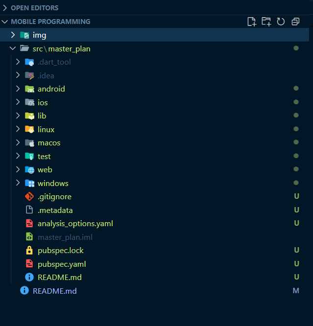
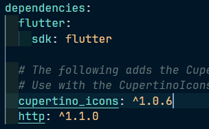
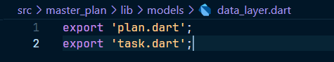
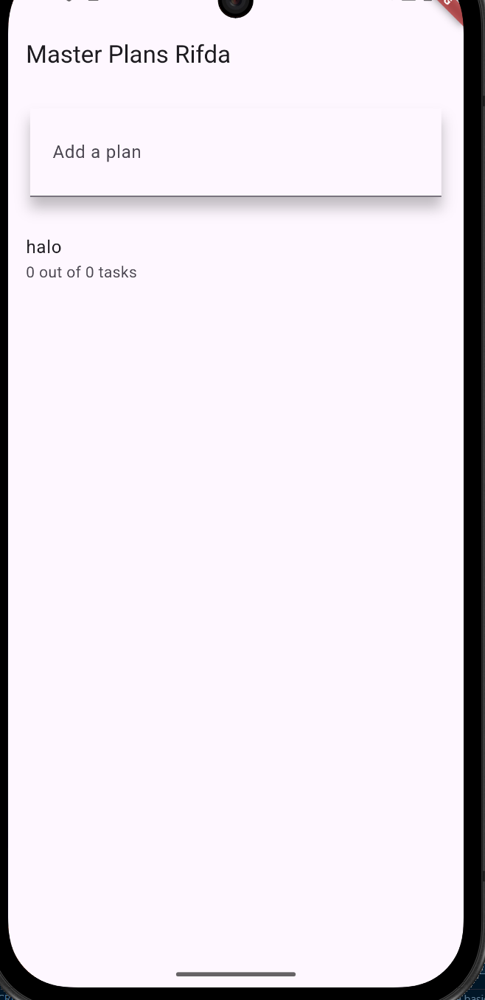
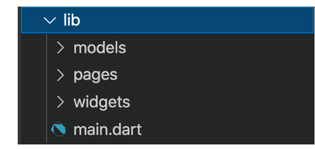

<p align="center">
  
</p>

<h1 align="center">LAPORAN PRAKTIKUM</h1>
<h2 align="center">JOBSHEET 06</h2>
<h3 align="center">Layout dan Navigasi</h3>

---

<div align="center">

### **Dosen Pembimbing**
**Habibie Ed Dien, S.Kom., M.T.**

---

### **Disusun oleh**
**Nama**  : Muhammad Rifda Musyaffa' 

**NIM**   : 2341720028 

**Kelas** : TI-3G  

**Program Studi** : D-4 Teknik Informatika  

---

### **Alamat Kampus**
Politeknik Negeri Malang  
Jl. Soekarno Hatta No.9, Jatimulyo, Kec. Lowokwaru, Kota Malang, Jawa Timur 65141
**Phone** : (0341) 404424, 404425
**Email** : [Polinema.ac.id](https://www.polinema.ac.id)

</div>

---

### Praktikum 1: Membangun Layout di Flutter

## Langkah 1
 Buat Project Baru



## Langkah 2
Buka file main.dart lalu ganti dengan kode berikut. Isi nama dan NIM Anda di text title.
```dart
import 'package:flutter/material.dart';

void main() => runApp(const MyApp());

class MyApp extends StatelessWidget {
  const MyApp({super.key});

  @override
  Widget build(BuildContext context) {
    return MaterialApp(
      title: 'Flutter layout: Nama dan NIM Anda',
      home: Scaffold(
        appBar: AppBar(
          title: const Text('Flutter layout demo'),
        ),
        body: const Center(
          child: Text('Hello World'),
        ),
      ),
    );
  }
}
```

**Output:**


## Langkah 3
Langkah pertama adalah memecah tata letak menjadi elemen dasarnya:

* Identifikasi baris dan kolom.
* Apakah tata letaknya menyertakan kisi-kisi (grid)?
* Apakah ada elemen yang tumpang tindih?
* Apakah UI memerlukan tab?
* Perhatikan area yang memerlukan alignment, padding, * atau borders.

Pertama, identifikasi elemen yang lebih besar. Dalam contoh ini, empat elemen disusun menjadi sebuah kolom: sebuah gambar, dua baris, dan satu blok teks.


Selanjutnya, buat diagram setiap baris. Baris pertama, disebut bagian Judul, memiliki 3 anak: kolom teks, ikon bintang, dan angka. Anak pertamanya, kolom, berisi 2 baris teks. Kolom pertama itu memakan banyak ruang, sehingga harus dibungkus dengan widget yang Diperluas.


Baris kedua, disebut bagian Tombol, juga memiliki 3 anak: setiap anak merupakan kolom yang berisi ikon dan teks.


Setelah tata letak telah dibuat diagramnya, cara termudah adalah dengan menerapkan pendekatan bottom-up. Untuk meminimalkan kebingungan visual dari kode tata letak yang banyak bertumpuk, tempatkan beberapa implementasi dalam variabel dan fungsi.

### Langkah 4: Implementasi title row

Pertama, Anda akan membuat kolom bagian kiri pada judul. Tambahkan kode berikut di bagian atas metode build() di dalam kelas MyApp:
```dart
Widget titleSection = Container(
  padding: const EdgeInsets.all(...),
  child: Row(
    children: [
      Expanded(
        /* soal 1*/
        child: Column(
          crossAxisAlignment: ...,
          children: [
            /* soal 2*/
            Container(
              padding: const EdgeInsets.only(bottom: ...),
              child: const Text(
                'Wisata Gunung di Batu',
                style: TextStyle(
                  fontWeight: FontWeight.bold,
                ),
              ),
            ),
            Text(
              'Batu, Malang, Indonesia',
              style: TextStyle(...),
            ),
          ],
        ),
      ),
      /* soal 3*/
      Icon(
       ...,
        color: ...,
      ),
      const Text(...),
    ],
  ),
);
```

**soal 1**  
Letakkan widget Column di dalam widget Expanded agar menyesuaikan ruang yang tersisa di dalam widget Row. Tambahkan properti crossAxisAlignment ke CrossAxisAlignment.start sehingga posisi kolom berada di awal baris.

**soal 2** 
Letakkan baris pertama teks di dalam Container sehingga memungkinkan Anda untuk menambahkan padding = 8. Teks ‘Batu, Malang, Indonesia' di dalam Column, set warna menjadi abu-abu.

**soal 3** 
Dua item terakhir di baris judul adalah ikon bintang, set dengan warna merah, dan teks "41". Seluruh baris ada di dalam Container dan beri padding di sepanjang setiap tepinya sebesar 32 piksel. Kemudian ganti isi body text ‘Hello World' dengan variabel titleSection seperti berikut:



**Kode Program:**
```dart
import 'package:flutter/material.dart';

void main() => runApp(const MyApp());

class MyApp extends StatelessWidget {
  const MyApp({super.key});

  @override
  Widget build(BuildContext context) {
    Widget titleSection = Container(
      // Padding untuk seluruh baris
      padding: const EdgeInsets.all(32),
      child: Row(
        children: [
          Expanded(
            /* soal 1: Column di dalam Expanded dan crossAxisAlignment diatur */
            child: Column(
              crossAxisAlignment:
                  CrossAxisAlignment.start, // Posisi kolom di awal (kiri)
              children: [
                /* soal 2: Padding untuk teks judul dan warna abu-abu untuk sub-judul */
                Container(
                  padding: const EdgeInsets.only(bottom: 8), // Padding bawah 8
                  child: const Text(
                    'Wisata Gunung di Batu',
                    style: TextStyle(fontWeight: FontWeight.bold),
                  ),
                ),
                Text(
                  'Batu, Malang, Indonesia',
                  style: TextStyle(
                    color: Colors.grey[500], // Warna teks menjadi abu-abu
                  ),
                ),
              ],
            ),
          ),
          /* soal 3: Ikon bintang merah dan teks "41" */
          Icon(
            Icons.star, // Ikon bintang
            color: Colors.red[500], // Warna ikon merah
          ),
          const Text('41'), // Teks '41'
        ],
      ),
    );

    return MaterialApp(
      title: 'Flutter layout: Muhammad Rifda Musyaffa\' | 2341720028',
      home: Scaffold(
        appBar: AppBar(title: const Text('Flutter layout demo')),
        body: Column(children: [titleSection]),
      ),
    );
  }
}
```

**Output**


---

# Praktikum 2: Implementasi button row

### Langkah 1: Buat method Column _buildButtonColumn
Bagian tombol berisi 3 kolom yang menggunakan tata letak yang sama—sebuah ikon di atas baris teks. Kolom pada baris ini diberi jarak yang sama, dan teks serta ikon diberi warna primer.

Karena kode untuk membangun setiap kolom hampir sama, buatlah metode pembantu pribadi bernama buildButtonColumn(), yang mempunyai parameter warna, Icon dan Text, sehingga dapat mengembalikan kolom dengan widgetnya sesuai dengan warna tertentu.

lib/main.dart (_buildButtonColumn)
```dart
class MyApp extends StatelessWidget {
  const MyApp({super.key});

  @override
  Widget build(BuildContext context) {
    // ···
  }

  Column _buildButtonColumn(Color color, IconData icon, String label) {
    return Column(
      mainAxisSize: MainAxisSize.min,
      mainAxisAlignment: MainAxisAlignment.center,
      children: [
        Icon(icon, color: color),
        Container(
          margin: const EdgeInsets.only(top: 8),
          child: Text(
            label,
            style: TextStyle(
              fontSize: 12,
              fontWeight: FontWeight.w400,
              color: color,
            ),
          ),
        ),
      ],
    );
  }
}
```

### Langkah 2: Buat widget buttonSection
Buat Fungsi untuk menambahkan ikon langsung ke kolom. Teks berada di dalam Container dengan margin hanya di bagian atas, yang memisahkan teks dari ikon.

Bangun baris yang berisi kolom-kolom ini dengan memanggil fungsi dan set warna, Icon, dan teks khusus melalui parameter ke kolom tersebut. Sejajarkan kolom di sepanjang sumbu utama menggunakan MainAxisAlignment.spaceEvenly untuk mengatur ruang kosong secara merata sebelum, di antara, dan setelah setiap kolom. Tambahkan kode berikut tepat di bawah deklarasi titleSection di dalam metode build():

lib/main.dart (buttonSection)
```dart
Color color = Theme.of(context).primaryColor;

Widget buttonSection = Row(
  mainAxisAlignment: MainAxisAlignment.spaceEvenly,
  children: [
    _buildButtonColumn(color, Icons.call, 'CALL'),
    _buildButtonColumn(color, Icons.near_me, 'ROUTE'),
    _buildButtonColumn(color, Icons.share, 'SHARE'),
  ],
);
```


### Langkah 3: Tambah button section ke body
Tambahkan variabel buttonSection ke dalam body seperti berikut:


**Kode Program:**

```dart
import 'package:flutter/material.dart';

void main() => runApp(const MyApp());

class MyApp extends StatelessWidget {
  const MyApp({super.key});

  @override
  Widget build(BuildContext context) {
    Widget titleSection = Container(
      // Padding untuk seluruh baris
      padding: const EdgeInsets.all(32),
      child: Row(
        children: [
          Expanded(
            /* soal 1: Column di dalam Expanded dan crossAxisAlignment diatur */
            child: Column(
              crossAxisAlignment:
                  CrossAxisAlignment.start, // Posisi kolom di awal (kiri)
              children: [
                /* soal 2: Padding untuk teks judul dan warna abu-abu untuk sub-judul */
                Container(
                  padding: const EdgeInsets.only(bottom: 8), // Padding bawah 8
                  child: const Text(
                    'Wisata Gunung di Batu',
                    style: TextStyle(fontWeight: FontWeight.bold),
                  ),
                ),
                Text(
                  'Batu, Malang, Indonesia',
                  style: TextStyle(
                    color: Colors.grey[500], // Warna teks menjadi abu-abu
                  ),
                ),
              ],
            ),
          ),
          /* soal 3: Ikon bintang merah dan teks "41" */
          Icon(
            Icons.star, // Ikon bintang
            color: Colors.red[500], // Warna ikon merah
          ),
          const Text('41'), // Teks '41'
        ],
      ),
    );

    Column _buildButtonColumn(Color color, IconData icon, String label) {
      return Column(
        mainAxisSize: MainAxisSize.min,
        mainAxisAlignment: MainAxisAlignment.center,
        children: [
          Icon(icon, color: color),
          Container(
            margin: const EdgeInsets.only(top: 8),
            child: Text(
              label,
              style: TextStyle(
                fontSize: 12,
                fontWeight: FontWeight.w400,
                color: color,
              ),
            ),
          ),
        ],
      );
    }

    Color color = Theme.of(context).primaryColor;

    Widget buttonSection = Row(
      mainAxisAlignment: MainAxisAlignment.spaceEvenly,
      children: [
        _buildButtonColumn(color, Icons.call, 'CALL'),
        _buildButtonColumn(color, Icons.near_me, 'ROUTE'),
        _buildButtonColumn(color, Icons.share, 'SHARE'),
      ],
    );

    return MaterialApp(
      title: 'Flutter layout: Muhammad Rifda Musyaffa\' | 2341720028',
      home: Scaffold(
        appBar: AppBar(title: const Text('Flutter layout demo')),
        body: Column(children: [titleSection, buttonSection]),
      ),
    );
  }
}
```

**Output**


---

# Praktikum 3: Implementasi text section

## Langkah 1
Tentukan bagian teks sebagai variabel. Masukkan teks ke dalam Container dan tambahkan padding di sepanjang setiap tepinya. Tambahkan kode berikut tepat di bawah deklarasi buttonSection:
```dart
Widget textSection = Container(
  padding: const EdgeInsets.all(32),
  child: const Text(
    'Carilah teks di internet yang sesuai '
    'dengan foto atau tempat wisata yang ingin '
    'Anda tampilkan. '
    'Tambahkan nama dan NIM Anda sebagai '
    'identitas hasil pekerjaan Anda. '
    'Selamat mengerjakan 🙂.',
    softWrap: true,
  ),
);
```
Dengan memberi nilai softWrap = true, baris teks akan memenuhi lebar kolom sebelum membungkusnya pada batas kata.

## Langkah 2: Tambahkan variabel text section ke body
Tambahkan widget variabel textSection ke dalam body seperti berikut:


**Kode Program**
```dart
import 'package:flutter/material.dart';

void main() => runApp(const MyApp());

class MyApp extends StatelessWidget {
  const MyApp({super.key});

  @override
  Widget build(BuildContext context) {
    Widget titleSection = Container(
      // Padding untuk seluruh baris
      padding: const EdgeInsets.all(32),
      child: Row(
        children: [
          Expanded(
            /* soal 1: Column di dalam Expanded dan crossAxisAlignment diatur */
            child: Column(
              crossAxisAlignment:
                  CrossAxisAlignment.start, // Posisi kolom di awal (kiri)
              children: [
                /* soal 2: Padding untuk teks judul dan warna abu-abu untuk sub-judul */
                Container(
                  padding: const EdgeInsets.only(bottom: 8), // Padding bawah 8
                  child: const Text(
                    'Wisata Gunung di Batu',
                    style: TextStyle(fontWeight: FontWeight.bold),
                  ),
                ),
                Text(
                  'Batu, Malang, Indonesia',
                  style: TextStyle(
                    color: Colors.grey[500], // Warna teks menjadi abu-abu
                  ),
                ),
              ],
            ),
          ),
          /* soal 3: Ikon bintang merah dan teks "41" */
          Icon(
            Icons.star, // Ikon bintang
            color: Colors.red[500], // Warna ikon merah
          ),
          const Text('41'), // Teks '41'
        ],
      ),
    );

    Column _buildButtonColumn(Color color, IconData icon, String label) {
      return Column(
        mainAxisSize: MainAxisSize.min,
        mainAxisAlignment: MainAxisAlignment.center,
        children: [
          Icon(icon, color: color),
          Container(
            margin: const EdgeInsets.only(top: 8),
            child: Text(
              label,
              style: TextStyle(
                fontSize: 12,
                fontWeight: FontWeight.w400,
                color: color,
              ),
            ),
          ),
        ],
      );
    }

    Color color = Theme.of(context).primaryColor;

    Widget buttonSection = Row(
      mainAxisAlignment: MainAxisAlignment.spaceEvenly,
      children: [
        _buildButtonColumn(color, Icons.call, 'CALL'),
        _buildButtonColumn(color, Icons.near_me, 'ROUTE'),
        _buildButtonColumn(color, Icons.share, 'SHARE'),
      ],
    );

    Widget textSection = Container(
      padding: const EdgeInsets.all(32),
      child: const Text(
        'Carilah teks di internet yang sesuai '
        'dengan foto atau tempat wisata yang ingin '
        'Anda tampilkan. '
        'Tambahkan nama dan NIM Anda sebagai '
        'identitas hasil pekerjaan Anda. '
        'Selamat mengerjakan 🙂.',
        softWrap: true,
      ),
    );

    return MaterialApp(
      title: 'Flutter layout: Muhammad Rifda Musyaffa\' | 2341720028',
      home: Scaffold(
        appBar: AppBar(title: const Text('Flutter layout demo')),
        body: Column(children: [titleSection, buttonSection, textSection]),
      ),
    );
  }
}
```

**Output:**



Saya merubah title dengan nama saya.

---

# Praktikum 4: Implementasi image section

### Langkah 1: Siapkan aset gambar
Anda dapat mencari gambar di internet yang ingin ditampilkan. Buatlah folder images di root project layout_flutter. Masukkan file gambar tersebut ke folder images, lalu set nama file tersebut ke file pubspec.yaml seperti berikut:


```yaml
flutter:

  # The following line ensures that the Material Icons font is
  # included with your application, so that you can use the icons in
  # the material Icons class.
  uses-material-design: true
  assets:
    - images/lake.jpg
```

### Langkah 2: Tambahkan gambar ke body
Tambahkan aset gambar ke dalam body seperti berikut:

**Kode Program**
```dart
return MaterialApp(
      title: 'Flutter layout: Muhammad Rifda Musyaffa\' | 2341720028',
      home: Scaffold(
        appBar: AppBar(title: const Text('Flutter layout demo')),
        body: Column(
          children: [
            Image.asset(
              "images/lake.jpg",
              width: 600,
              height: 240,
              fit: BoxFit.cover,
            ),
            titleSection,
            buttonSection,
            textSection,
          ],
        ),
      ),
    );
```
BoxFit.cover memberi tahu kerangka kerja bahwa gambar harus sekecil mungkin tetapi menutupi seluruh kotak rendernya.


**Output**


## Langkah 3: Terakhir, ubah menjadi ListView
Pada langkah terakhir ini, atur semua elemen dalam ListView, bukan Column, karena ListView mendukung scroll yang dinamis saat aplikasi dijalankan pada perangkat yang resolusinya lebih kecil.


**Kode Program**
```dart
return MaterialApp(
      title: 'Flutter layout: Muhammad Rifda Musyaffa\' | 2341720028',
      home: Scaffold(
        appBar: AppBar(title: const Text('Flutter layout demo')),
        body: ListView(
          children: [
            Image.asset(
              "images/lake.jpg",
              width: 600,
              height: 240,
              fit: BoxFit.cover,
            ),
            titleSection,
            buttonSection,
            textSection,
          ],
        ),
      ),
    );
```


**Hasil:**


---

# Tugas Praktikum 1
1. Selesaikan Praktikum 1 sampai 4, lalu dokumentasikan dan push ke repository Anda berupa screenshot setiap hasil pekerjaan beserta penjelasannya di file README.md!✅

2. Silakan implementasikan di project baru "basic_layout_flutter" dengan mengakses sumber ini:
https://docs.flutter.dev/codelabs/layout-basics ✅

### 1. Komposisi Widget
 Ini adalah konsep inti di Flutter, di mana kita membangun antarmuka (UI) dengan menggabungkan dan menyusun widget-widget kecil menjadi satu kesatuan yang lebih besar, mirip seperti menyusun balok Lego.
 ```dart
body: ListView(
  children: [
    Image.asset(
      'images/lake.jpg',
      width: 600,
      height: 240,
      fit: BoxFit.cover,
    ),
    titleSection, // Ini adalah widget ListTile
    Card( // Ini adalah widget Card
      // ... Card ini berisi widget lain di dalamnya
    ),
  ],
),
 ```

  Kode tersebut menunjukkan komposisi tingkat atas pada aplikasi Anda, di mana ListView (widget utama) disusun dari Image, ListTile, dan Card.

  ### 2. Row dan Column
Ini adalah dua widget fundamental untuk mengatur tata letak. Row digunakan untuk menyusun widget secara horizontal (mendatar), sedangkan Column digunakan untuk menyusun widget secara vertikal (menurun).

Kode Program Contoh Row untuk menyejajarkan tombol-tombol:
 ```dart
Widget buttonSection = Row(
  mainAxisAlignment: MainAxisAlignment.spaceEvenly,
  children: [
    _buildButtonColumn(color, Icons.call, 'CALL'),
    _buildButtonColumn(color, Icons.near_me, 'ROUTE'),
    _buildButtonColumn(color, Icons.share, 'SHARE'),
  ],
);
 ```

Contoh Column untuk menumpuk ikon dan teks tombol:
```dart
Column _buildButtonColumn(Color color, IconData icon, String label) {
  return Column(
    mainAxisSize: MainAxisSize.min,
    mainAxisAlignment: MainAxisAlignment.center,
    children: [
      Icon(icon, color: color),
      Container(
        // ...
      ),
    ],
  );
}
```

### 3. ListView
ListView adalah widget yang mirip dengan Column, namun memiliki kemampuan istimewa untuk bisa digulir (scroll) secara otomatis jika konten di dalamnya melebihi ukuran layar. Ini sangat penting untuk mencegah error overflow dan memastikan aplikasi berjalan baik di berbagai ukuran layar.
 ```dart
body: ListView(
  children: [
    Image.asset(
      // ...
    ),
    titleSection,
    Card(
      // ...
    ),
  ],
),
 ```

 Kode ini menempatkan semua bagian UI utama (Image, titleSection, Card) di dalam ListView sebagai body dari Scaffold.

  ### 4. Container
 Container adalah sebuah "wadah" serbaguna yang bisa Anda gunakan untuk "membungkus" widget lain. Fungsinya bisa untuk memberi jarak (margin atau padding), warna latar belakang, atau dekorasi seperti bingkai (border).
 ```dart
// ... di dalam _buildButtonColumn
Container(
  margin: const EdgeInsets.only(top: 8, bottom: 8),
  child: Text(
    label,
    // ...
  ),
),
// ...
 ```

  Dalam kode ini, Container digunakan secara spesifik untuk memberikan margin (jarak atas dan bawah) pada teks di dalam setiap tombol.

  ### 5. Card
 Card adalah sebuah widget dari Material Design yang berfungsi sebagai panel dengan sudut membulat dan efek bayangan (elevation). Ini digunakan untuk mengelompokkan informasi yang saling terkait dan memberinya tampilan yang menonjol secara visual.
 ```dart
Card(
  margin: const EdgeInsets.all(16.0),
  elevation: 4.0, // Memberi efek bayangan
  child: Column(
    children: [
      buttonSection,
      textSection,
    ],
  ),
),
 ```

  Kode ini menggunakan Card untuk membungkus buttonSection dan textSection, menggabungkan keduanya dalam satu panel yang terangkat secara visual.

  ### 6. ListTile
 ListTile adalah widget baris (row) yang sudah distilisasi dan dioptimalkan untuk menampilkan item dalam sebuah daftar. Widget ini sangat praktis karena menyediakan slot khusus seperti title (judul), subtitle (subjudul), dan trailing (untuk widget di sisi kanan), sehingga menyederhanakan pembuatan baris yang kompleks.
 ```dart
Widget titleSection = ListTile(
  title: const Text(
    'Oeschinen Lake Campground',
    style: TextStyle(fontWeight: FontWeight.bold),
  ),
  subtitle: Text(
    'Kandersteg, Switzerland',
    style: TextStyle(color: Colors.grey[500]),
  ),
  trailing: Row(
    mainAxisSize: MainAxisSize.min,
    children: [
      Icon(Icons.star, color: Colors.red[500]),
      const Text('41'),
    ],
  ),
  contentPadding: const EdgeInsets.all(32),
);
 ```

  Kode ini menggantikan struktur Row dan Column yang rumit untuk bagian judul dengan sebuah ListTile yang ringkas dan mudah dibaca.

### 7. Stack
Stack adalah widget yang digunakan untuk menumpuk beberapa widget di atas satu sama lain, mirip seperti menumpuk kartu atau foto. Widget pertama dalam daftar children akan menjadi lapisan paling bawah (dasar), dan widget-widget berikutnya akan ditumpuk di atasnya. Untuk mengatur posisi widget yang ditumpuk secara presisi, kita sering menggunakan widget Positioned di dalamnya.
```dart
Stack(
  alignment: Alignment.bottomLeft,
  children: [
    Image.asset(
      'images/lake.jpg',
      width: 600,
      height: 240,
      fit: BoxFit.cover,
    ),
    Positioned(
      bottom: 16,
      left: 16,
      child: Container(
        padding:
            const EdgeInsets.symmetric(vertical: 8, horizontal: 12),
        color: Colors.black54,
        child: const Text(
          'Oeschinen Lake',
          style: TextStyle(
            fontSize: 20,
            fontWeight: FontWeight.bold,
            color: Colors.white,
          ),
        ),
      ),
    ),
  ],
)
```
Kode ini menggunakan Stack untuk menempatkan sebuah Positioned Container berisi teks di atas Image.asset.

**Kode Program Lengkap:**
```dart
import 'package:flutter/material.dart';

void main() => runApp(const MyApp());

class MyApp extends StatelessWidget {
  const MyApp({super.key});

  @override
  Widget build(BuildContext context) {
    Widget titleSection = ListTile(
      title: const Text(
        'Oeschinen Lake Campground',
        style: TextStyle(fontWeight: FontWeight.bold),
      ),
      subtitle: Text(
        'Kandersteg, Switzerland',
        style: TextStyle(color: Colors.grey[500]),
      ),
      trailing: Row(
        mainAxisSize: MainAxisSize.min,
        children: [
          Icon(Icons.star, color: Colors.red[500]),
          const Text('41'),
        ],
      ),
      contentPadding: const EdgeInsets.all(32),
    );

    Color color = Theme.of(context).primaryColor;

    Widget buttonSection = Row(
      mainAxisAlignment: MainAxisAlignment.spaceEvenly,
      children: [
        _buildButtonColumn(color, Icons.call, 'CALL'),
        _buildButtonColumn(color, Icons.near_me, 'ROUTE'),
        _buildButtonColumn(color, Icons.share, 'SHARE'),
      ],
    );

    Widget textSection = const Padding(
      padding: EdgeInsets.all(32),
      child: Text(
        'Lake Oeschinen lies at the foot of the Blüemlisalp in the Bernese '
        'Alps. Situated 1,578 meters above sea level, it is one of the '
        'larger Alpine Lakes. A gondola ride from Kandersteg, followed by a '
        'half-hour walk through pastures and pine forest, leads you to the '
        'lake, which warms to 20 degrees Celsius in the summer. Activities '
        'enjoyed here include rowing, and riding the summer toboggan run.',
        softWrap: true,
      ),
    );

    return MaterialApp(
      title: 'Flutter layout demo',
      home: Scaffold(
        appBar: AppBar(title: const Text('Flutter layout demo')),
        body: ListView(
          children: [
            Stack(
              alignment: Alignment.bottomLeft,
              children: [
                Image.asset(
                  'images/lake.jpg',
                  width: 600,
                  height: 240,
                  fit: BoxFit.cover,
                ),
                Positioned(
                  bottom: 16,
                  left: 16,
                  child: Container(
                    padding: const EdgeInsets.symmetric(
                      vertical: 8,
                      horizontal: 12,
                    ),
                    color: Colors.black54,
                    child: const Text(
                      'Oeschinen Lake',
                      style: TextStyle(
                        fontSize: 20,
                        fontWeight: FontWeight.bold,
                        color: Colors.white,
                      ),
                    ),
                  ),
                ),
              ],
            ),
            titleSection,
            Card(
              margin: const EdgeInsets.all(16.0),
              elevation: 4.0,
              child: Column(children: [buttonSection, textSection]),
            ),
          ],
        ),
      ),
    );
  }

  Column _buildButtonColumn(Color color, IconData icon, String label) {
    return Column(
      mainAxisSize: MainAxisSize.min,
      mainAxisAlignment: MainAxisAlignment.center,
      children: [
        Icon(icon, color: color),
        Container(
          margin: const EdgeInsets.only(top: 8, bottom: 8),
          child: Text(
            label,
            style: TextStyle(
              fontSize: 12,
              fontWeight: FontWeight.w400,
              color: color,
            ),
          ),
        ),
      ],
    );
  }
}
```
**Output**


3. Kumpulkan link commit repository GitHub Anda kepada dosen yang telah disepakati!✅

---

#  Praktikum 5: Membangun Navigasi di Flutter

## Langkah 1: Siapkan project baru
Sebelum melanjutkan praktikum, buatlah sebuah project baru Flutter dengan nama belanja dan susunan folder seperti pada gambar berikut. Penyusunan ini dimaksudkan untuk mengorganisasi kode dan widget yang lebih mudah.



## Langkah 2: Mendefinisikan Route
Buatlah dua buah file dart dengan nama home_page.dart dan item_page.dart pada folder pages. Untuk masing-masing file, deklarasikan class HomePage pada file home_page.dart dan ItemPage pada item_page.dart. Turunkan class dari StatelessWidget. Gambaran potongan kode dapat anda lihat sebagai berikut.


**Kode Program:**
**Kode Program:**
* home_page.dart
```dart
import 'package:flutter/material.dart';
import 'package:belanja/models/item.dart';

class HomePage extends StatelessWidget {
  @override
  Widget build(BuildContext context) {
    //TODO: Implement build

    throw UnimplementedError();
  }
}
```
* item_page.dart
```dart
import 'package:flutter/material.dart';

class ItemPage extends StatelessWidget {
  @override
  Widget build(BuildContext context) {
    //TODO: Implement build

    throw UnimplementedError();
  }
}
```

## Langkah 3: Lengkapi Kode di main.dart
Setelah kedua halaman telah dibuat dan didefinisikan, bukalah file main.dart. Pada langkah ini anda akan mendefinisikan Route untuk kedua halaman tersebut. Definisi penamaan route harus bersifat unique. Halaman HomePage didefinisikan sebagai /. Dan halaman ItemPage didefinisikan sebagai /item. Untuk mendefinisikan halaman awal, anda dapat menggunakan named argument initialRoute. Gambaran tahapan ini, dapat anda lihat pada potongan kode berikut.


**Kode Program:**
```dart
import 'package:flutter/material.dart';
import 'package:belanja/pages/home_page.dart';
import 'package:belanja/pages/item_page.dart';

void main() {
  runApp(
    MaterialApp(
      initialRoute: '/',
      routes: {'/': (context) => HomePage(), '/item': (context) => ItemPage()},
    ),
  );
}
```

##  Langkah 4: Membuat data model
Sebelum melakukan perpindahan halaman dari HomePage ke ItemPage, dibutuhkan proses pemodelan data. Pada desain mockup, dibutuhkan dua informasi yaitu nama dan harga. Untuk menangani hal ini, buatlah sebuah file dengan nama item.dart dan letakkan pada folder models. Pada file ini didefinisikan pemodelan data yang dibutuhkan. Ilustrasi kode yang dibutuhkan, dapat anda lihat pada potongan kode berikut.


**Kode Program:**
```dart
class Item {
  String name;
  int price;

  Item({required this.name, required this.price});
}
```

## Langkah 5: Lengkapi kode di class HomePage
Pada halaman HomePage terdapat ListView widget. Sumber data ListView diambil dari model List dari object Item. Gambaran kode yang dibutuhkan untuk melakukan definisi model dapat anda lihat sebagai berikut.


**Kode Program:**
```dart
import 'package:flutter/material.dart';
import 'package:belanja/models/item.dart';

class HomePage extends StatelessWidget {
  final List<Item> items = [
    Item(name: 'Sugar', price: 5000),
    Item(name: 'Salt', price: 2000),
  ];

  @override
  Widget build(BuildContext context) {
    throw UnimplementedError();
  }
}
```

## Langkah 6: Membuat ListView dan itemBuilder
Untuk menampilkan ListView pada praktikum ini digunakan itemBuilder. Data diambil dari definisi model yang telah dibuat sebelumnya. Untuk menunjukkan batas data satu dan berikutnya digunakan widget Card. Kode yang telah umum pada bagian ini tidak ditampilkan. Gambaran kode yang dibutuhkan dapat anda lihat sebagai berikut.


**Kode Program home_page.dart:**
```dart
import 'package:flutter/material.dart';
import 'package:belanja/models/item.dart';

class HomePage extends StatelessWidget {
  final List<Item> items = [
    Item(name: 'Sugar', price: 5000),
    Item(name: 'Salt', price: 2000),
  ];

  @override
  Widget build(BuildContext context) {
    return Scaffold(
      appBar: AppBar(
        title: const Text('Shopping List'),
        backgroundColor: Colors.blueAccent,
        foregroundColor: Colors.white,
      ),
      body: Container(
        margin: EdgeInsets.all(8),
        child: ListView.builder(
          padding: EdgeInsets.all(8),
          itemCount: items.length,
          itemBuilder: (context, index) {
            final item = items[index];
            return Card(
              child: Container(
                margin: EdgeInsets.all(8),
                child: Row(
                  children: [
                    Expanded(child: Text(item.name)),
                    Expanded(
                      child: Text(
                        item.price.toString(),
                        textAlign: TextAlign.end,
                      ), // Text
                    ), // Expanded
                  ],
                ), // Row
              ), // Container
            ); // Card
          },
        ), // ListView.builder
      ), // Container
    );
  }
}
```

Jalankan aplikasi pada emulator atau pada device anda.


### Langkah 7: Menambahkan aksi pada ListView
Item pada ListView saat ini ketika ditekan masih belum memberikan aksi tertentu. Untuk menambahkan aksi pada ListView dapat digunakan widget InkWell atau GestureDetector. Perbedaan utamanya InkWell merupakan material widget yang memberikan efek ketika ditekan. Sedangkan GestureDetector bersifat umum dan bisa juga digunakan untuk gesture lain selain sentuhan. Pada praktikum ini akan digunakan widget InkWell.

Untuk menambahkan sentuhan, letakkan cursor pada widget pembuka Card. Kemudian gunakan shortcut quick fix dari VSCode (Ctrl + . pada Windows atau Cmd + . pada MacOS). Sorot menu wrap with widget... Ubah nilai widget menjadi InkWell serta tambahkan named argument onTap yang berisi fungsi untuk berpindah ke halaman ItemPage. Ilustrasi potongan kode dapat anda lihat pada potongan berikut.


**Kode Program:**
```dart
import 'package:flutter/material.dart';
import 'package:belanja/models/item.dart';

class HomePage extends StatelessWidget {
  final List<Item> items = [
    Item(name: 'Sugar', price: 5000),
    Item(name: 'Salt', price: 2000),
  ];

  @override
  Widget build(BuildContext context) {
    return Scaffold(
      appBar: AppBar(
        title: const Text('Shopping List'),
        backgroundColor: Colors.blueAccent,
        foregroundColor: Colors.white,
      ),
      body: Container(
        margin: EdgeInsets.all(8),
        child: ListView.builder(
          padding: EdgeInsets.all(8),
          itemCount: items.length,
          itemBuilder: (context, index) {
            final item = items[index];
            return InkWell(
              onTap: () {
                Navigator.pushNamed(context, '/item', arguments: item);
              },
              child: Card(
                child: Container(
                  margin: EdgeInsets.all(8),
                  child: Row(
                    children: [
                      Expanded(child: Text(item.name)),
                      Expanded(
                        child: Text(
                          item.price.toString(),
                          textAlign: TextAlign.end,
                        ), // Text
                      ), // Expanded
                    ],
                  ), // Row
                ), // Container
              ),
            ); // Card
          },
        ), // ListView.builder
      ), // Container
    );
  }
}
```
Saya menambahkan kode di dalam onTap saat menuju route '/item' dengan mengirim data item dari HomePage.
```dart
onTap: () {
Navigator.pushNamed(context, '/item', arguments: item);
},
```

Saat aplikasi dijalankan, akan muncul error Unimplemented, karena di halaman ItemPage belum ada kode untuk menampilkan sebuah widget melainkan melempar error.

**Error**


Agar berhasil berpindah halaman, maka kita perlu merubah isi kode di file item_page.dart agar menampilkan detail item yang dikirim melalui halaman home.

**Kode Perbaikan item_page.dart:**
```dart
import 'package:flutter/material.dart';
import 'package:belanja/models/item.dart';

class ItemPage extends StatelessWidget {
  const ItemPage({super.key});

  @override
  Widget build(BuildContext context) {
    final item = ModalRoute.of(context)!.settings.arguments as Item;

    return Scaffold(
      appBar: AppBar(
        title: Text(item.name),
        backgroundColor: Colors.blueAccent,
        foregroundColor: Colors.white,
      ),
      body: Center(
        child: Card(
          elevation: 4,
          margin: const EdgeInsets.all(24),
          child: Padding(
            padding: const EdgeInsets.all(32.0),
            child: Column(
              mainAxisSize: MainAxisSize.min,
              children: [
                Text(
                  item.name,
                  style: const TextStyle(
                    fontSize: 28,
                    fontWeight: FontWeight.bold,
                  ),
                ),
                const SizedBox(height: 16),
                Text(
                  'Price: ${item.price}',
                  style: const TextStyle(fontSize: 20),
                ),
              ],
            ),
          ),
        ),
      ),
    );
  }
}
```

**Output**


---

### Tugas Praktikum 2

---


1. Untuk melakukan pengiriman data ke halaman berikutnya, cukup menambahkan informasi arguments pada penggunaan Navigator. Perbarui kode pada bagian Navigator menjadi seperti berikut. ✅
```dart
Navigator.pushNamed(context, '/item', arguments: item);
```

**Kode Program:**
```dart
import 'package:flutter/material.dart';
import 'package:belanja/models/item.dart';

class HomePage extends StatelessWidget {
  final List<Item> items = [
    Item(name: 'Sugar', price: 5000),
    Item(name: 'Salt', price: 2000),
  ];

  @override
  Widget build(BuildContext context) {
    return Scaffold(
      appBar: AppBar(
        title: const Text('Shopping List'),
        backgroundColor: Colors.blueAccent,
        foregroundColor: Colors.white,
      ),
      body: Container(
        margin: EdgeInsets.all(8),
        child: ListView.builder(
          padding: EdgeInsets.all(8),
          itemCount: items.length,
          itemBuilder: (context, index) {
            final item = items[index];
            return InkWell(
              onTap: () {
                Navigator.pushNamed(context, '/item', arguments: item);
              },
              child: Card(
                child: Container(
                  margin: EdgeInsets.all(8),
                  child: Row(
                    children: [
                      Expanded(child: Text(item.name)),
                      Expanded(
                        child: Text(
                          item.price.toString(),
                          textAlign: TextAlign.end,
                        ), // Text
                      ), // Expanded
                    ],
                  ), // Row
                ), // Container
              ),
            ); // Card
          },
        ), // ListView.builder
      ), // Container
    );
  }
}
```

2. Pembacaan nilai yang dikirimkan pada halaman sebelumnya dapat dilakukan menggunakan ModalRoute. Tambahkan kode berikut pada blok fungsi build dalam halaman ItemPage. Setelah nilai didapatkan, anda dapat menggunakannya seperti penggunaan variabel pada umumnya. (https://docs.flutter.dev/cookbook/navigation/navigate-with-arguments) ✅
```dart
final itemArgs = ModalRoute.of(context)!.settings.arguments as Item;
```

**Kode Program:**
```dart
import 'package:flutter/material.dart';
import 'package:belanja/models/item.dart';

class ItemPage extends StatelessWidget {
  const ItemPage({super.key});

  @override
  Widget build(BuildContext context) {
    final item = ModalRoute.of(context)!.settings.arguments as Item;

    return Scaffold(
      appBar: AppBar(
        title: Text(item.name),
        backgroundColor: Colors.blueAccent,
        foregroundColor: Colors.white,
      ),
      body: Center(
        child: Card(
          elevation: 4,
          margin: const EdgeInsets.all(24),
          child: Padding(
            padding: const EdgeInsets.all(32.0),
            child: Column(
              mainAxisSize: MainAxisSize.min,
              children: [
                Text(
                  item.name,
                  style: const TextStyle(
                    fontSize: 28,
                    fontWeight: FontWeight.bold,
                  ),
                ),
                const SizedBox(height: 16),
                Text(
                  'Price: ${item.price}',
                  style: const TextStyle(fontSize: 20),
                ),
              ],
            ),
          ),
        ),
      ),
    );
  }
}
```

**Catatan: Soal 1 dan soal 2 sduah dilakukan dan terdapat hasil outputnya pada praktikum 5 langkah 7**

3. Pada hasil akhir dari aplikasi belanja yang telah anda selesaikan, tambahkan atribut foto produk, stok, dan rating. Ubahlah tampilan menjadi GridView seperti di aplikasi marketplace pada umumnya. ✅

### Langkah 1: Membuat folder images dan mengunggah foto produk


### Langkah 2: Menambahkan assets di file pubspec.yaml
```yaml
assets:
    - assets/images/
```

### Langkah 3: Menambahkan properti baru untuk image, stock, dan rating di item.dart
```dart
class Item {
  String name;
  int price;
  String image; 
  int stock;    
  double rating; 

  Item({
    required this.name,
    required this.price,
    required this.image,
    required this.stock,
    required this.rating,
  });
}
```

### Langkah 4: Memperbarui Tampilan home_page.dart menjadi GridView
Merubah ListView.builder menjadi GridView.builder dan menyesuaikan itemBuilder untuk menampilkan data baru dalam format kartu yang sesuai untuk grid.

```dart
import 'package:flutter/material.dart';
import 'package:belanja/models/item.dart';

class HomePage extends StatelessWidget {
  final List<Item> items = [
    Item(name: 'Sugar', price: 5000, image: 'assets/images/gula.jpg', stock: 15, rating: 4.5),
    Item(name: 'Salt', price: 2000, image: 'assets/images/garam.jpg', stock: 20, rating: 4.8),
    Item(name: 'Cooking Oil', price: 12000, image: 'assets/images/minyak.jpg', stock: 10, rating: 4.2),
    Item(name: 'Flour', price: 8000, image: 'assets/images/tepung.jpg', stock: 25, rating: 4.6),
    Item(name: 'Rice', price: 55000, image: 'assets/images/beras.jpg', stock: 5, rating: 4.9),
  ];

  HomePage({super.key});

  @override
  Widget build(BuildContext context) {
    return Scaffold(
      appBar: AppBar(
        title: const Text('Shopping Marketplace'),
      ),
      body: GridView.builder(
        gridDelegate: const SliverGridDelegateWithFixedCrossAxisCount(
          crossAxisCount: 2, 
          childAspectRatio: 0.8, 
          crossAxisSpacing: 10,
          mainAxisSpacing: 10,
        ),
        padding: const EdgeInsets.all(10),
        itemCount: items.length,
        itemBuilder: (context, index) {
          final item = items[index];
          return Card(
            elevation: 3,
            child: Column(
              crossAxisAlignment: CrossAxisAlignment.start,
              children: [
                Expanded(
                  child: Center(
                    child: Image.asset(item.image, fit: BoxFit.cover),
                  ),
                ),
                Padding(
                  padding: const EdgeInsets.all(8.0),
                  child: Text(item.name, style: const TextStyle(fontWeight: FontWeight.bold)),
                ),
                Padding(
                  padding: const EdgeInsets.symmetric(horizontal: 8.0),
                  child: Text('Rp ${item.price}', style: const TextStyle(color: Colors.deepOrange)),
                ),
                Padding(
                  padding: const EdgeInsets.all(8.0),
                  child: Row(
                    mainAxisAlignment: MainAxisAlignment.spaceBetween,
                    children: [
                      Text('Stok: ${item.stock}'),
                      Row(
                        children: [
                          const Icon(Icons.star, color: Colors.amber, size: 16),
                          Text(item.rating.toString()),
                        ],
                      ),
                    ],
                  ),
                ),
              ],
            ),
          );
        },
      ),
    );
  }
}
```
**Output**


4. Silakan implementasikan Hero widget pada aplikasi belanja Anda dengan mempelajari dari sumber ini: https://docs.flutter.dev/cookbook/navigation/hero-animations ✅


5. Sesuaikan dan modifikasi tampilan sehingga menjadi aplikasi yang menarik. Selain itu, pecah widget menjadi kode yang lebih kecil. Tambahkan Nama dan NIM di footer aplikasi belanja Anda. ✅

**Jawaban soal 4 dan 5**

### Langkah 1: Menambahkan atribut deskripsi di model item (item.dart)
```dart
class Item {
  String name;
  int price;
  String image;
  int stock;
  double rating;
  String description;

  Item({
    required this.name,
    required this.price,
    required this.image,
    required this.stock,
    required this.rating,
    required this.description,
  });
}
```

### Langkah 2: Memberi value ke atribut deskripsi secara statis di home_page.dart
```dart
Item(
        name: 'Sugar',
        price: 5000,
        image: 'assets/images/gula.jpg',
        stock: 15,
        rating: 4.5,
        description: 'Gula pasir putih berkualitas tinggi, diproses secara higienis untuk menghasilkan rasa manis yang alami.'),
    Item(
        name: 'Salt',
        price: 2000,
        image: 'assets/images/garam.jpg',
        stock: 20,
        rating: 4.8,
        description: 'Garam meja beryodium yang akan menyempurnakan setiap masakan Anda dengan rasa asin yang pas.'),
    Item(
        name: 'Cooking Oil',
        price: 12000,
        image: 'assets/images/minyak.jpg',
        stock: 10,
        rating: 4.2,
        description: 'Minyak goreng kelapa sawit, jernih dan berkualitas, membuat gorengan lebih renyah dan lezat.'),
    Item(
        name: 'Flour',
        price: 8000,
        image: 'assets/images/tepung.jpg',
        stock: 25,
        rating: 4.6,
        description: 'Tepung terigu serbaguna yang cocok untuk membuat aneka kue, roti, dan masakan lainnya.'),
    Item(
        name: 'Rice',
        price: 55000,
        image: 'assets/images/beras.jpg',
        stock: 5,
        rating: 4.9,
        description: 'Beras putih pulen pilihan dari padi berkualitas, memberikan nasi yang lezat dan bergizi untuk keluarga.'),
```

### Langkah 3: Menerapkan Hero Widget
Membungkus widget Image.asset di HomePage dan ItemPage dengan Hero widget.
```dart
// lib/pages/home_page.dart
import 'package:flutter/material.dart';
import 'package:belanja/models/item.dart';
import 'package:belanja/widgets/item_card.dart';

class HomePage extends StatelessWidget {
  final List<Item> items = [
    Item(
      name: 'Sugar',
      price: 5000,
      image: 'assets/images/gula.jpg',
      stock: 15,
      rating: 4.5,
      description:
          'Gula pasir putih berkualitas tinggi, diproses secara higienis untuk menghasilkan rasa manis yang alami.',
    ),
    Item(
      name: 'Salt',
      price: 2000,
      image: 'assets/images/garam.jpg',
      stock: 20,
      rating: 4.8,
      description:
          'Garam meja beryodium yang akan menyempurnakan setiap masakan Anda dengan rasa asin yang pas.',
    ),
    Item(
      name: 'Cooking Oil',
      price: 12000,
      image: 'assets/images/minyak.jpg',
      stock: 10,
      rating: 4.2,
      description:
          'Minyak goreng kelapa sawit, jernih dan berkualitas, membuat gorengan lebih renyah dan lezat.',
    ),
    Item(
      name: 'Flour',
      price: 8000,
      image: 'assets/images/tepung.jpg',
      stock: 25,
      rating: 4.6,
      description:
          'Tepung terigu serbaguna yang cocok untuk membuat aneka kue, roti, dan masakan lainnya.',
    ),
    Item(
      name: 'Rice',
      price: 55000,
      image: 'assets/images/beras.jpg',
      stock: 5,
      rating: 4.9,
      description:
          'Beras putih pulen pilihan dari padi berkualitas, memberikan nasi yang lezat dan bergizi untuk keluarga.',
    ),
  ];

  HomePage({super.key});

  @override
  Widget build(BuildContext context) {
    return Scaffold(
      appBar: AppBar(title: const Text('Shopping Marketplace')),
      body: GridView.builder(
        gridDelegate: const SliverGridDelegateWithFixedCrossAxisCount(
          crossAxisCount: 2,
          childAspectRatio: 0.8,
          crossAxisSpacing: 10,
          mainAxisSpacing: 10,
        ),
        padding: const EdgeInsets.all(10),
        itemCount: items.length,
        itemBuilder: (context, index) {
          final item = items[index];
          return InkWell(
            onTap: () {
              Navigator.pushNamed(context, '/item', arguments: item);
            },
            child: ItemCard(item: item),
          );
        },
      ),
      bottomNavigationBar: const BottomAppBar(
        child: Padding(
          padding: EdgeInsets.all(8.0),
          child: Text(
            'Muhammad Rifda Musyaffa\' | 2341720028',
            style: TextStyle(fontWeight: FontWeight.bold),
          ),
        ),
      ),
    );
  }
}
```
Memastikan tag pada Hero widget sama persis di kedua halaman untuk item yang sama. Tag harus unik untuk setiap item.

### Langkah 4: Membuat file item_card.dart di folder lib/widgets


```dart
import 'package:flutter/material.dart';
import 'package:belanja/models/item.dart';

class ItemCard extends StatelessWidget {
  final Item item;
  const ItemCard({super.key, required this.item});

  @override
  Widget build(BuildContext context) {
    return Card(
      elevation: 3,
      child: Column(
        crossAxisAlignment: CrossAxisAlignment.start,
        children: [
          Expanded(
            child: Center(
              child: Hero(
                tag: 'itemImage_${item.name}',
                child: Image.asset(item.image, fit: BoxFit.cover),
              ),
            ),
          ),
          Padding(
            padding: const EdgeInsets.all(8.0),
            child: Text(item.name, style: const TextStyle(fontWeight: FontWeight.bold)),
          ),
          Padding(
            padding: const EdgeInsets.symmetric(horizontal: 8.0),
            child: Text('Rp ${item.price}', style: const TextStyle(color: Colors.deepOrange)),
          ),
          Padding(
            padding: const EdgeInsets.all(8.0),
            child: Row(
              mainAxisAlignment: MainAxisAlignment.spaceBetween,
              children: [
                Text('Stok: ${item.stock}'),
                Row(
                  children: [
                    const Icon(Icons.star, color: Colors.amber, size: 16),
                    Text(item.rating.toString()),
                  ],
                ),
              ],
            ),
          ),
        ],
      ),
    );
  }
}
```
Kode tersebut digunakan untuk widget setiap item card di HomePage.

### Langkah 5: Memperbarui item_page.dart untuk menerima data baru dan menerapkan Hero widget

```dart
import 'package:flutter/material.dart';
import 'package:belanja/models/item.dart';

class ItemPage extends StatelessWidget {
  const ItemPage({super.key});

  @override
  Widget build(BuildContext context) {
    final item = ModalRoute.of(context)!.settings.arguments as Item;

    return Scaffold(
      appBar: AppBar(
        title: Text(item.name),
        backgroundColor: Colors.blueAccent,
        foregroundColor: Colors.white,
      ),
      body: SingleChildScrollView(
        padding: const EdgeInsets.all(16.0),
        child: Column(
          crossAxisAlignment: CrossAxisAlignment.start,
          children: [
            Hero(
              tag: 'itemImage_${item.name}',
              child: ClipRRect(
                borderRadius: BorderRadius.circular(12.0),
                child: Image.asset(
                  item.image,
                  fit: BoxFit.cover,
                  width: double.infinity,
                  height: 250,
                ),
              ),
            ),
            const SizedBox(height: 16),

            Card(
              elevation: 4,
              shape: RoundedRectangleBorder(
                borderRadius: BorderRadius.circular(10),
              ),
              child: Padding(
                padding: const EdgeInsets.all(16.0),
                child: Column(
                  crossAxisAlignment: CrossAxisAlignment.start,
                  children: [
                    Text(
                      item.name,
                      style: const TextStyle(
                        fontSize: 28,
                        fontWeight: FontWeight.bold,
                      ),
                    ),
                    const SizedBox(height: 8),
                    Text(
                      'Rp ${item.price}',
                      style: const TextStyle(
                        fontSize: 22,
                        color: Colors.deepOrange,
                        fontWeight: FontWeight.w600,
                      ),
                    ),
                    const SizedBox(height: 12),
                    const Divider(),
                    const SizedBox(height: 12),
                    Row(
                      mainAxisAlignment: MainAxisAlignment.spaceBetween,
                      children: [
                        Text(
                          'Stok Tersisa: ${item.stock}',
                          style: TextStyle(
                            fontSize: 16,
                            color: Colors.grey.shade700,
                          ),
                        ),
                        Row(
                          children: [
                            const Icon(
                              Icons.star,
                              color: Colors.amber,
                              size: 20,
                            ),
                            const SizedBox(width: 4),
                            Text(
                              item.rating.toString(),
                              style: const TextStyle(
                                fontSize: 16,
                                fontWeight: FontWeight.bold,
                              ),
                            ),
                          ],
                        ),
                      ],
                    ),
                  ],
                ),
              ),
            ),
            const SizedBox(height: 20),

            Card(
              elevation: 2,
              shape: RoundedRectangleBorder(
                borderRadius: BorderRadius.circular(10),
              ),
              child: Padding(
                padding: EdgeInsets.all(16.0),
                child: Column(
                  crossAxisAlignment: CrossAxisAlignment.start,
                  children: [
                    Text(
                      'Deskripsi Produk',
                      style: TextStyle(
                        fontSize: 18,
                        fontWeight: FontWeight.bold,
                      ),
                    ),
                    SizedBox(height: 8),
                    Text(
                      item.description,
                      style: const TextStyle(fontSize: 16, height: 1.5),
                      textAlign: TextAlign.justify,
                    ),
                  ],
                ),
              ),
            ),
            const SizedBox(height: 24),

            SizedBox(
              width: double.infinity,
              child: ElevatedButton.icon(
                onPressed: () {},
                icon: const Icon(Icons.shopping_cart, color: Colors.white),
                label: const Text(
                  'Beli Sekarang',
                  style: TextStyle(fontSize: 18, color: Colors.white),
                ),
                style: ElevatedButton.styleFrom(
                  padding: const EdgeInsets.symmetric(vertical: 16),
                  backgroundColor: Colors.blueAccent,
                  shape: RoundedRectangleBorder(
                    borderRadius: BorderRadius.circular(10),
                  ),
                ),
              ),
            ),
          ],
        ),
      ),
    );
  }
}
```

**Output**


6. Selesaikan Praktikum 5: Navigasi dan Rute tersebut. Cobalah modifikasi menggunakan plugin go_router, lalu dokumentasikan dan push ke repository Anda berupa screenshot setiap hasil pekerjaan beserta penjelasannya di file README.md. Kumpulkan link commit repository GitHub Anda kepada dosen yang telah disepakati! ✅

### Langkah 1: Menambahkan Dependency go_router


 tambahkan go_router ke dalam file pubspec.yaml, Setelah menambahkan, jalankan perintah `flutter pub get` di terminal untuk mengunduh paketnya.

 ### Langkah 2: Membuat Konfigurasi Router
Buat file baru di dalam folder lib bernama app_router.dart untuk menampung semua konfigurasi rute Anda. Ini akan membuat kode navigasi terpusat dan rapi.


Di dalam file ini, kita akan mendefinisikan semua halaman yang bisa diakses di aplikasi.
```dart
import 'package:go_router/go_router.dart';
import 'package:belanja/pages/home_page.dart';
import 'package:belanja/pages/item_page.dart';
import 'package:belanja/models/item.dart';

final GoRouter router = GoRouter(
  routes: [
    GoRoute(path: '/', builder: (context, state) => HomePage()),
    GoRoute(
      path: '/item/:name',
      builder: (context, state) {
        final Item item = state.extra as Item;
        return ItemPage(item: item);
      },
    ),
  ],
);
```
**Penjelasan**
* GoRoute: Setiap halaman diwakili oleh sebuah GoRoute.

* path: '/item/:name': Ini adalah cara go_router menangani parameter dinamis. :name adalah placeholder untuk nama item yang akan dikirimkan.

* state.extra as Item: Berbeda dari ModalRoute, go_router menggunakan state.extra untuk mengirim dan menerima objek kompleks (seperti kelas Item) antar halaman.

### Langkah 3: Memperbarui main.dart
Ubah main.dart untuk menggunakan MaterialApp.router dan konfigurasi router yang baru dibuat.
```dart
import 'package:flutter/material.dart';
import 'package:belanja/app_router.dart';

void main() {
  runApp(const MyApp());
}

class MyApp extends StatelessWidget {
  const MyApp({super.key});

  // This widget is the root of your application.
  @override
  Widget build(BuildContext context) {
    return MaterialApp.router(
      routerConfig: router,
      debugShowCheckedModeBanner: false,
    );
  }
}

class MyHomePage extends StatefulWidget {
  const MyHomePage({super.key, required this.title});

  // This widget is the home page of your application. It is stateful, meaning
  // that it has a State object (defined below) that contains fields that affect
  // how it looks.

  // This class is the configuration for the state. It holds the values (in this
  // case the title) provided by the parent (in this case the App widget) and
  // used by the build method of the State. Fields in a Widget subclass are
  // always marked "final".

  final String title;

  @override
  State<MyHomePage> createState() => _MyHomePageState();
}

class _MyHomePageState extends State<MyHomePage> {
  int _counter = 0;

  void _incrementCounter() {
    setState(() {
      // This call to setState tells the Flutter framework that something has
      // changed in this State, which causes it to rerun the build method below
      // so that the display can reflect the updated values. If we changed
      // _counter without calling setState(), then the build method would not be
      // called again, and so nothing would appear to happen.
      _counter++;
    });
  }

  @override
  Widget build(BuildContext context) {
    // This method is rerun every time setState is called, for instance as done
    // by the _incrementCounter method above.
    //
    // The Flutter framework has been optimized to make rerunning build methods
    // fast, so that you can just rebuild anything that needs updating rather
    // than having to individually change instances of widgets.
    return Scaffold(
      appBar: AppBar(
        // TRY THIS: Try changing the color here to a specific color (to
        // Colors.amber, perhaps?) and trigger a hot reload to see the AppBar
        // change color while the other colors stay the same.
        backgroundColor: Theme.of(context).colorScheme.inversePrimary,
        // Here we take the value from the MyHomePage object that was created by
        // the App.build method, and use it to set our appbar title.
        title: Text(widget.title),
      ),
      body: Center(
        // Center is a layout widget. It takes a single child and positions it
        // in the middle of the parent.
        child: Column(
          // Column is also a layout widget. It takes a list of children and
          // arranges them vertically. By default, it sizes itself to fit its
          // children horizontally, and tries to be as tall as its parent.
          //
          // Column has various properties to control how it sizes itself and
          // how it positions its children. Here we use mainAxisAlignment to
          // center the children vertically; the main axis here is the vertical
          // axis because Columns are vertical (the cross axis would be
          // horizontal).
          //
          // TRY THIS: Invoke "debug painting" (choose the "Toggle Debug Paint"
          // action in the IDE, or press "p" in the console), to see the
          // wireframe for each widget.
          mainAxisAlignment: MainAxisAlignment.center,
          children: <Widget>[
            const Text('You have pushed the button this many times:'),
            Text(
              '$_counter',
              style: Theme.of(context).textTheme.headlineMedium,
            ),
          ],
        ),
      ),
      floatingActionButton: FloatingActionButton(
        onPressed: _incrementCounter,
        tooltip: 'Increment',
        child: const Icon(Icons.add),
      ), // This trailing comma makes auto-formatting nicer for build methods.
    );
  }
}
```
Menggunakan MaterialApp.router dan properti routerConfig untuk memberitahu Flutter agar menyerahkan semua urusan navigasi kepada go_router.

### Langkah 4: Ubah Cara Navigasi di HomePage
Ganti Navigator.pushNamed dengan context.push().
```dart
return InkWell(
  onTap: () {
    context.push('/item/${item.name}', extra: item);
  },
  child: ItemCard(item: item),
);
```
context.push('/item/${item.name}', extra: item):

* /item/${item.name}: Membangun URL dinamis dengan menyisipkan nama item.

* extra: item: Mengirim seluruh objek item melalui parameter extra.

### Langkah 5: Ubah Cara Menerima Data di ItemPage
Terakhir ayo kita ubah ItemPage agar menerima data melalui konstruktornya, bukan lagi dari ModalRoute.
```dart
class ItemPage extends StatelessWidget {
  final Item item;
  const ItemPage({super.key, required this.item});
```

***Output**


---

