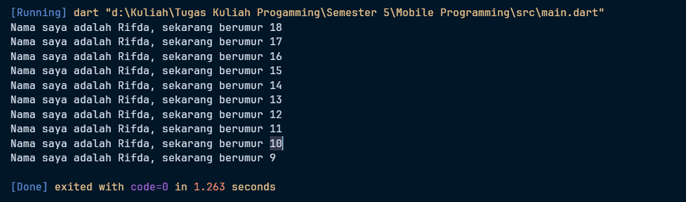
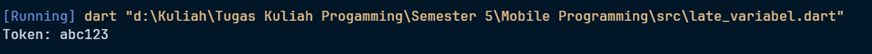

# Jobsheet 2 - Pemrograman Mobile

  * [cite\_start]**Nama:** Muhammad Rifda Musyaffa’ [cite: 1]
  * [cite\_start]**NIM:** 2341720028 [cite: 1]
  * [cite\_start]**Kelas:** TI-3G [cite: 1]
  * [cite\_start]**Semester:** 5 [cite: 1]
  * [cite\_start]**Program Studi:** D4 – Teknik Informatika [cite: 1]

-----

## Praktikum 1: Modifikasi Kode

[cite\_start]Terdapat sebuah kode Dart yang perlu dimodifikasi pada baris ke-3[cite: 4].

**Kode Awal**
```dart
void main() {
  for (int i = 0; i < 10; i++) {
    print('hello ${i + 2}');
  }
}
```
**Output yang Diinginkan**
`Nama saya adalah Fulan, sekarang berumur 18` hingga `Nama saya adalah Fulan, sekarang berumur 9`

**Jawaban/Deskripsi**
[cite\_start]Untuk mendapatkan output yang diinginkan, variabel `i` diatur dengan nilai awal 20, dan kondisi `i > 10` digunakan agar perulangan berhenti saat nilai `i` mencapai 11[cite: 6]. [cite\_start]Digunakan juga operator `decrement` (`i--`) untuk mengurangi nilai `i` di setiap perulangan[cite: 6]. [cite\_start]Di dalam perulangan, nilai `i` dikurangi 2 pada fungsi `print()` untuk menghasilkan output yang sesuai[cite: 6].

**Kode yang Telah Dimodifikasi**
```dart
void main() {
  /*
  Modifikasilah kode pada baris 4 di VS Code atau Editor Code favorit Anda berikut ini agar mendapatkan keluaran (output) sesuai yang diminta!
  for (int i = 0; i < 10; i++) {
    print('hello ${i + 2}');
  }
  
  Output yang diminta:
  Nama saya adalah Fulan, sekarang berumur 18
  Nama saya adalah Fulan, sekarang berumur 17
  Nama saya adalah Fulan, sekarang berumur 16
  Nama saya adalah Fulan, sekarang berumur 15
  Nama saya adalah Fulan, sekarang berumur 14
  Nama saya adalah Fulan, sekarang berumur 13
  Nama saya adalah Fulan, sekarang berumur 12
  Nama saya adalah Fulan, sekarang berumur 11
  Nama saya adalah Fulan, sekarang berumur 10
  Nama saya adalah Fulan, sekarang berumur 9
  */

  for (int i = 20; i > 10; i--) {
    print('Nama saya adalah Fulan, sekarang berumur ${i - 2}');
  }
}
```

**Hasil Eksekusi**

-----

## Praktikum 2: Memahami Peran Dart dalam Flutter

**Pertanyaan:** Mengapa sangat penting untuk memahami bahasa pemrograman Dart sebelum kita menggunakan framework Flutter? [cite\_start]Jelaskan\! [cite: 8]

**Jawaban:**
[cite\_start]Penting untuk memahami Dart karena seluruh pengembangan framework Flutter, termasuk kode aplikasi, kode plugin, dan manajemen dependensi, menggunakan bahasa Dart dan fitur-fiturnya[cite: 9]. [cite\_start]Pemahaman dasar yang kuat tentang Dart akan membantu Anda menjadi lebih produktif dan nyaman saat mengembangkan aplikasi dengan Flutter[cite: 9].

-----

## Praktikum 3: Rangkuman Codelab

[cite\_start]Berikut adalah poin-poin penting tentang Dart yang relevan untuk pengembangan aplikasi Flutter[cite: 11, 12].

1.  **Peran Dart dalam Flutter:**

      * [cite\_start]Dart adalah bahasa utama untuk pengembangan aplikasi Flutter, termasuk kode aplikasi dan manajemen dependensi[cite: 12].
      * [cite\_start]Memahami Dart adalah kunci untuk menjadi produktif dengan Flutter[cite: 12].

2.  **Kelebihan Utama Bahasa Dart:**

      * [cite\_start]**Portabilitas:** Dart dapat dikompilasi ke JavaScript untuk web atau ke kode mesin untuk platform lain, menjadikannya ideal untuk pengembangan lintas platform[cite: 12].
      * [cite\_start]**Keamanan dan Fleksibilitas:** Dart adalah bahasa yang `type-safe`, yang membantu menemukan *bug* lebih awal, tetapi tetap fleksibel dengan fitur *optional type annotations*[cite: 12].
      * [cite\_start]**Perkakas Produktif:** Dart memiliki ekosistem *tooling* yang lengkap, termasuk alat analisis kode dan plugin IDE[cite: 12].
      * [cite\_start]**Garbage Collection:** Dart mengelola memori secara otomatis, membebaskan pengembang dari tugas dealokasi memori manual[cite: 12].

3.  **Cara Kerja Dart (Eksekusi Kode):**

      * [cite\_start]**Kompilasi Just-In-Time (JIT):** Digunakan selama pengembangan dan *debugging*[cite: 12]. [cite\_start]Kompiler JIT memungkinkan fitur andalan Flutter, yaitu `hot reload`, yang menampilkan perubahan kode secara instan[cite: 12].
      * [cite\_start]**Kompilasi Ahead-Of-Time (AOT):** Digunakan untuk membuat aplikasi siap rilis, menghasilkan performa yang sangat cepat[cite: 12].

4.  **Dasar-Dasar Bahasa Dart:**

      * [cite\_start]**Struktur Kode:** Sintaks Dart mirip dengan C dan JavaScript, dengan fungsi `main()` sebagai titik awal eksekusi[cite: 12].
      * [cite\_start]**Berorientasi Objek (OOP):** Dart adalah bahasa berorientasi objek di mana semua data adalah turunan dari sebuah kelas[cite: 12].
      * [cite\_start]**Operator:** Operator di Dart adalah metode yang didefinisikan dalam kelas[cite: 12]. [cite\_start]Contohnya termasuk operator aritmatika (`+`, `-`), perbandingan (`==`, `!=`), dan logika (`!`, `||`)[cite: 12].

-----

## Praktikum 4: Perbedaan Null Safety dan Late Variables

[cite\_start]**Pertanyaan:** Buatlah slide yang berisi penjelasan dan contoh eksekusi kode tentang perbedaan Null Safety dan Late variabel\! [cite: 14]

**Jawaban:**

### Null Safety

[cite\_start]Fitur yang diperkenalkan pada Dart 2.12 ini mencegah *error* karena nilai `null`[cite: 16]. [cite\_start]Secara *default*, semua variabel adalah *non-nullable*, artinya mereka tidak dapat menyimpan nilai `null`[cite: 16]. [cite\_start]Jika sebuah variabel diizinkan untuk menjadi `null`, Anda harus secara eksplisit mendeklarasikannya dengan tanda `?`[cite: 16].

**Contoh Kode**
```dart
void main() {
  // Non-nullable
  String name = "Rifda";
  print("Name: $name");

  // Nullable
  String? nickname;
  print("Nickname: $nickname");

  if (nickname != null) {
    print("Length: ${nickname.length}");
  } else {
    print("Nickname masih null");
  }
}
```

**Hasil Eksekusi**

### Late Variable

[cite\_start]`late` adalah *keyword* yang digunakan untuk menunda inisialisasi variabel *non-nullable* hingga variabel tersebut benar-benar dibutuhkan[cite: 16]. [cite\_start]Ini memungkinkan Anda mendeklarasikan variabel tanpa langsung memberinya nilai, tanpa melanggar aturan *null safety*[cite: 16].

**Contoh Kode**
```dart
void main() {
  late String token; // non-nullable, tapi belum diisi
  
  // token belum bisa diakses sekarang
  token = "abc123"; // diisi belakangan
  print("Token: $token");
}
```

**Hasil Eksekusi**

### Perbandingan

| Fitur | Null Safety (?) | Late Variable (late) |
| :--- | :--- | :--- |
| **Nilai Awal** | [cite\_start]Bisa `null` tanpa *error*[cite: 16]. | [cite\_start]Harus diisi sebelum digunakan[cite: 16]. |
| **Tipe** | [cite\_start]`String?` (nullable)[cite: 16]. | [cite\_start]`late String` (non-nullable, inisialisasi ditunda)[cite: 16]. |
| **Akses sebelum diisi** | [cite\_start]Tidak menghasilkan *error* (hasil `null`)[cite: 16]. | [cite\_start]Menghasilkan *error* `LateInitializationError`[cite: 16]. |
| **Kapan Digunakan** | [cite\_start]Ketika variabel memang diizinkan untuk menjadi `null`[cite: 16]. | [cite\_start]Ketika variabel pasti akan memiliki nilai, tetapi tidak pada saat deklarasi[cite: 16]. |